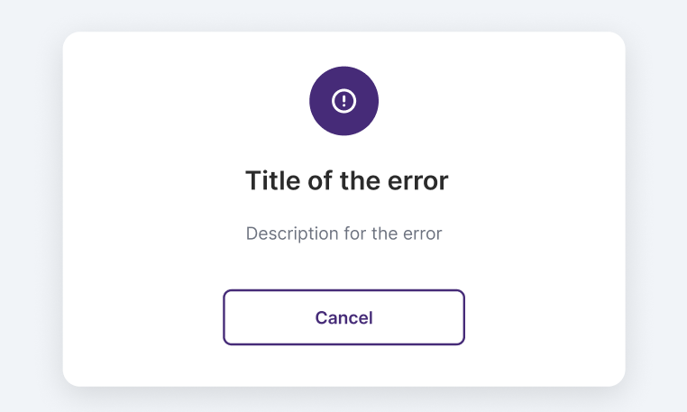

# Graphical User Interface Prototype

Date: 20/11/2025

Version: 1.0

## EZshop – UI Presentation
Below is the link to the Figma project containing the complete graphic user interface design for EZshop:

Figma link: [GUI prototype](https://www.figma.com/proto/Utdiz82GzSkDERVNPES4NA/UI-EZshop-Gruppo-13?page-id=1%3A2&node-id=304-583&p=f&viewport=437%2C-3645%2C0.29&t=oMiYEgM820zDXVQK-1&scaling=scale-down&content-scaling=fixed&starting-point-node-id=263%3A1557)

## Dynamic Navigation Bar
The navigation bar is designed to be dynamic, meaning its items automatically adjust based on the user’s permissions.\
Different roles will therefore see different menu entries, ensuring that each user only accesses the sections relevant to their privileges.

## Error Handling Approach
For error management within the interface, we chose to adopt a generic error banner that appears whenever an issue occurs.\
The banner works as a reusable component, and for each specific error case it will be dynamically filled with the corresponding title and message.\
This ensures consistency, simplicity, and a clear visual communication pattern throughout the application.

 
