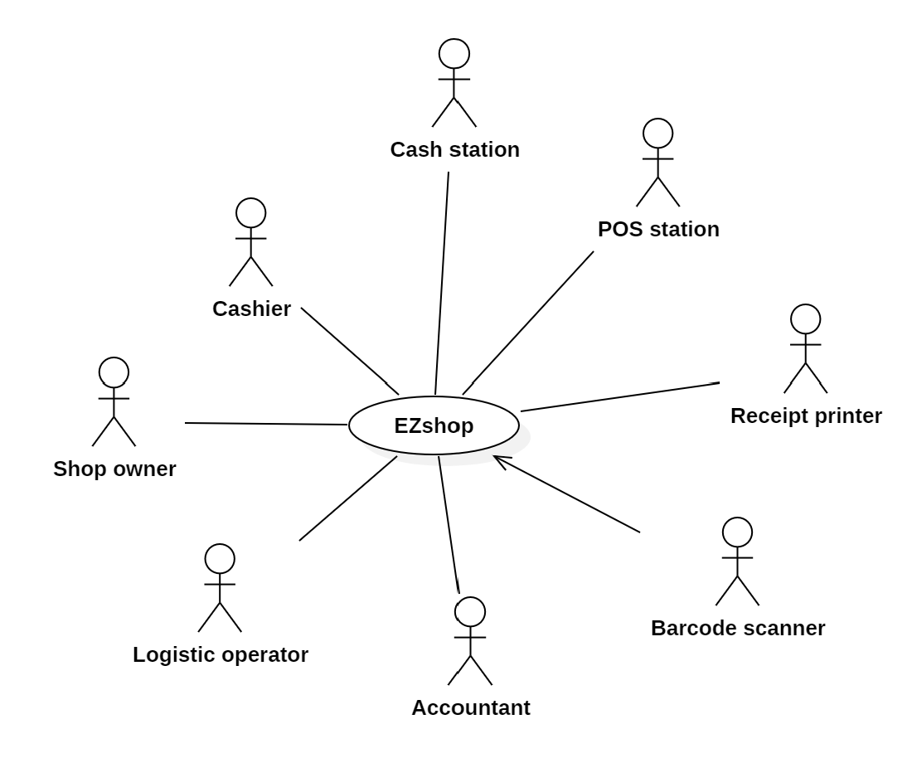
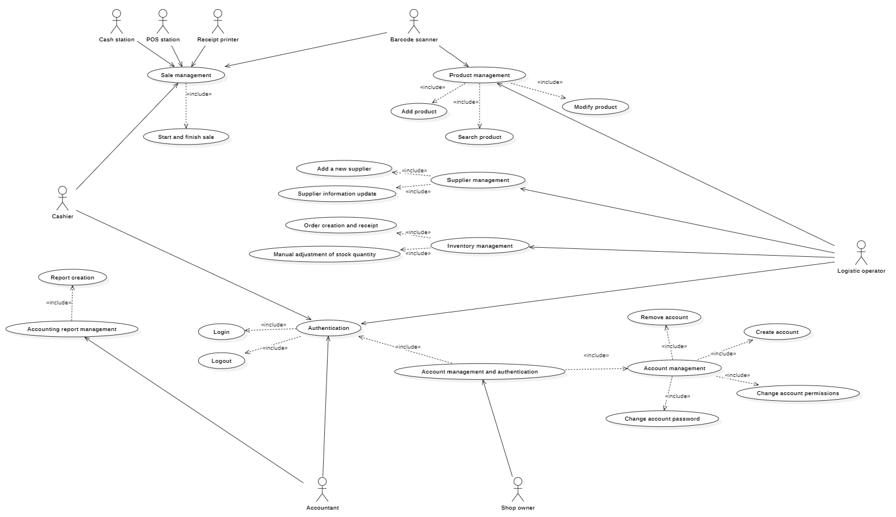
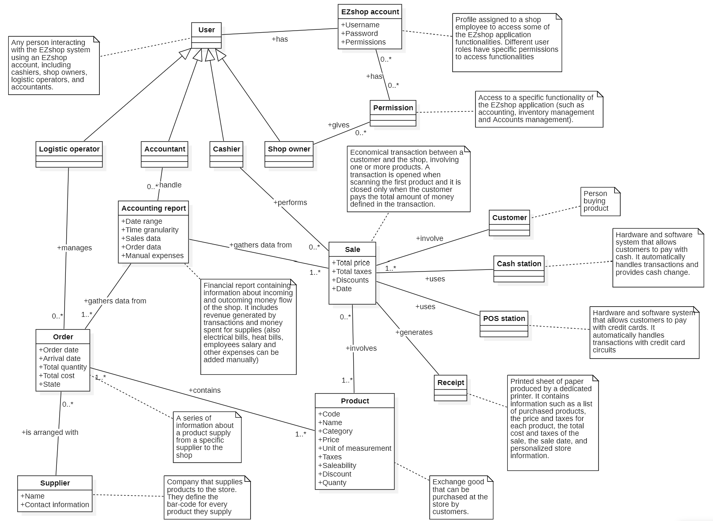
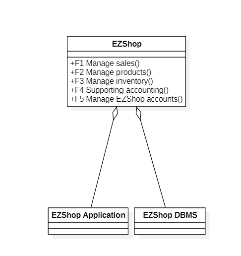
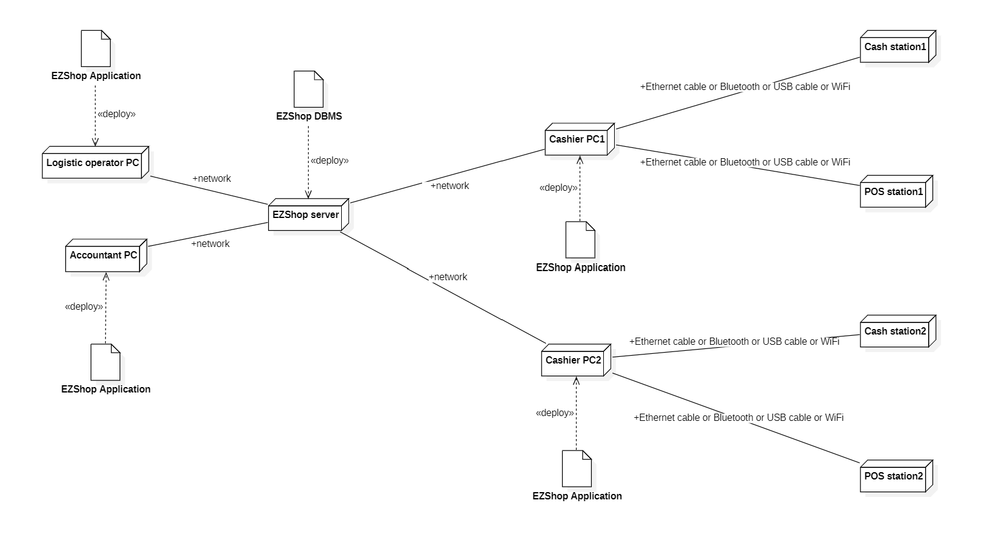

# Requirements Document - EZShop

Date: 24/10/2025

Version: 1.0.0

| Version number | Change |
| :------------: | :----: |
|                |        |

# Contents

- [Requirements Document - EzShop](#requirements-document)
- [Contents](#contents)
- [Informal description](#informal-description)
- [Business model](#business-model)
- [Stakeholders](#stakeholders)
- [Context Diagram and interfaces](#context-diagram-and-interfaces)
  - [Context Diagram](#context-diagram)
  - [Interfaces](#interfaces)
- [Functional and non functional requirements](#functional-and-non-functional-requirements)
  - [Functional Requirements](#functional-requirements)
  - [Non Functional Requirements](#non-functional-requirements)
- [Table of Rights](#table-of-rights)
- [Use case diagram and use cases](#use-case-diagram-and-use-cases)
  - [Use case diagram](#use-case-diagram)
    - [Use case 1, UC1 - Sale management](#use-case-1-uc1---sale-management)
      - [Scenario 1.1 - Successful sale](#scenario-11---successful-sale)
      - [Scenario 1.2 (Variant) - Removing product from active sale](#scenario-12-variant---removing-product-from-active-sale)
      - [Scenario 1.3 (Variant) - Product insertion with display message](#scenario-13-variant---product-insertion-with-display-message)
      - [Scenario 1.4 (Exception) - Product cannot be sold](#scenario-14-exception---product-cannot-be-sold)
      - [Scenario 1.5 (Exception) - Receipt printing failure](#scenario-15-exception---receipt-printing-failure)
      - [Scenario 1.6 (Exception) - Payment not completed](#scenario-16-exception---payment-not-completed)
    - [Use case 2, UC2 - Product management](#use-case-2-uc2---product-management)
      - [Scenario 2.1 - Add product](#scenario-21---add-product)
      - [Scenario 2.2 (Variant) - Add products from .csv file](#scenario-22-variant---add-products-from-csv-file)
      - [Scenario 2.3 (Exception) - Code already registered](#scenario-23-exception---code-already-registered)
      - [Scenario 2.4 (Exception) - Error importing .csv file](#scenario-24-exception---error-importing-csv-file)
      - [Scenario 2.5 - Search product](#scenario-25---search-product)
      - [Scenario 2.6 (Exception) - Product not found](#scenario-26-exception---product-not-found)
      - [Scenario 2.7 - Modify product](#scenario-27---modify-product)
      - [Scenario 2.8 (Exception) - Update product while a sale is in progress](#scenario-28-exception---update-product-while-a-sale-is-in-progress)
    - [Use case 3, UC3 - Inventory management](#use-case-3-uc3---inventory-management)
      - [Scenario 3.1 - Order creation and receipt](#scenario-31---order-creation-and-receipt)
      - [Scenario 3.2 - Manual adjustment of stock quantity](#scenario-32---manual-adjustment-of-stock-quantity)
      - [Scenario 3.3 (Exception) - Order cancellation](#scenario-33-exception---order-cancellation)
    - [Use case 4, UC4 - Supplier management](#use-case-4-uc4---supplier-management)
      - [Scenario 4.1 - Add a new supplier](#scenario-41---add-a-new-supplier)
      - [Scenario 4.2 - Supplier information update](#scenario-42---supplier-information-update)
      - [Scenario 4.3 (Exception) - Duplicate supplier entry](#scenario-43-exception---duplicate-supplier-entry)
    - [Use case 5, UC5 - Accounting report management](#use-case-5-uc5---accounting-report-management)
      - [Scenario 5.1 - Report creation](#scenario-51---report-creation)
      - [Scenario 5.2 (Variant) - Manual expense inclusion](#scenario-52-variant---manual-expense-inclusion)
      - [Scenario 5.3 (Variant) - Empty report](#scenario-53-variant---empty-report)
      - [Scenario 5.4 (Exception) - OS failure to create report file](#scenario-54-exception---os-failure-to-create-report-file)
    - [Use case 6, UC6 - Account management and authentication](#use-case-6-uc6---account-management-and-authentication)
      - [Scenario 6.1 - Account authentication (Login)](#scenario-61---account-authentication-login)
      - [Scenario 6.2 (Exception) - Authentication failed](#scenario-62-exception---authentication-failed)
      - [Scenario 6.3 - Logout](#scenario-63---logout)
      - [Scenario 6.4 - Create account](#scenario-64---create-account)
      - [Scenario 6.5 (Exception) - Duplicate account creation](#scenario-65-exception---duplicate-account-creation)
      - [Scenario 6.6 - Change account permissions](#scenario-66---change-account-permissions)
      - [Scenario 6.7 (Variant) - Change permissions for shop-owner own account](#scenario-67-variant---change-permissions-for-shop-owner-own-account)
      - [Scenario 6.8 - Change account password](#scenario-68---change-account-password)
      - [Scenario 6.9 - Remove account](#scenario-69---remove-account)
      - [Scenario 6.10 (Exception) - Remove shop-owner account](#scenario-610-exception---remove-shop-owner-account)
- [Glossary](#glossary)
- [System Design](#system-design)
- [Hardware Software architecture](#Hardware-software-architecture)

# Informal description

Small shops require a simple application to support the owner or manager. A small shop (ex a food shop) occupies 50-200 square meters, sells 500-2000 different item types, has two or a few more cash registers. 
EZShop is a software application to:
* manage sales
* manage inventory
* manage orders to suppliers
* support accounting

In the following describe the requirements of the EZShop application. 
You are free to define the application as you deem more useful and effective for the stakeholders. 
You are also free to modify the structure of the document when needed.
The document will be evaluated considering the typical defects in requirements (omissions, ambiguities, contradictions, etc), and syntactic errors in the formalism used (UML diagrams). 
Consider that the document should be delivered to another team (unknown to you)
 which will be in charge of designing and implementing the system. The design team should be able to proceed only with the information in the document.

# Business Model

### Customer Segment:
The target customer segment for EZshop is composed of owners of small shops who require a reliable, easy-to-use system to manage everyday shop activities. The primary users include the owner and shop employees, particularly cashiers, logistic operators and accountants.

### Value Proposition:
EZshop provides a desktop application for managing the main shop activities: sales processing, inventory tracking, suppliers and orders management and basic accounting.
The application can run on multiple computers at the same time, ensuring availability and stability of the shop’s operations even without requiring an internet connection, if the computers are connected to the same local network. EZshop relies on some external system only to manage payments and can work with regular barcode scanners to scan products, so the cost of the solution for shop owners is limited.  

### Revenue Stream:
The shop owner pays an initial fee that covers the software licence(s) and installation, first employees training. After a warranty period, the client will pay for system updates and technical assistance if they need it.

# Stakeholders

| Stakeholder name | Description |
| :--------------: | :--------- |
| Shop owner | Person who holds the role of system administrator |
| Cashier  | Employee responsible for overseeing sales. Their job is to process a customer sale |
| Logistic operator | Employee that manages inventory and handles orders to product suppliers |
| Accountant | Employee who handles the accounting reports created by EZshop |
| Cash station | Hardware and software system that allows customers to pay with cash. It automatically handles transactions and provides cash change. (e.g. [this](https://cashmatic.it/prodotti/selfpay/?gclid=Cj0KCQjwgpzIBhCOARIsABZm7vFn1HBO9fjzIP3ga-uvUXyKMNdOeX9g5ZvEqUyeSzf5ZBjQxBBWzq8aAj3jEALw_wcB)) |
| POS station | Hardware and software system that allows customers to pay with credit cards. It automatically handles transactions with credit card circuits. (e.g. [this](https://www.mypos.com/it-it)) |
| Barcode scanner | Portable scanner (e.g. [this](https://www.amazon.it/Yanzeo-USB-Barcode-Scanner-computer/dp/B07KD4C7WL?pd_rd_w=yKpzM&content-id=amzn1.sym.58ed5d1b-41a3-4c6c-a38c-3416ea9905f1&pf_rd_p=58ed5d1b-41a3-4c6c-a38c-3416ea9905f1&pf_rd_r=TFX7D02PYAGKE88FQ9XH&pd_rd_wg=mBPpY&pd_rd_r=a4f43118-426a-4c39-863c-88847ba043fa&pd_rd_i=B07KD4C7WL&th=1)) which can be used to scan barcodes found in product labels |
| Receipt printer | Dedicated printer system for producing the non-fiscal itemized receipt. (e.g. [this](https://www.amazon.it/NETUM-Stampante-termica-per-ricevute/dp/B0854CCF75?ref_=Oct_d_Oct_d_ss_d_6572840031_1&pd_rd_w=SIutK&content-id=amzn1.sym.3a84fb8b-d4d6-4483-8fd7-0000cb59ea5a&pf_rd_p=3a84fb8b-d4d6-4483-8fd7-0000cb59ea5a&pf_rd_r=X5XJMQ88AS3PNWAM8167&pd_rd_wg=YZ1PH&pd_rd_r=a73378a2-7d7f-458e-ba9d-d6eff854a21d&pd_rd_i=B0854CCF75)) |
| Customer | Person that purchases products at the shop |

# Context Diagram and interfaces

## Context Diagram

## Interfaces

|   Actor   |  Physical Interface | Logical Interface |
| :-------: | :--------------- | :---------------- |
| Shop owner | Monitor, mouse e keyboard / monitor touch| GUI (Graphic User Interface) |
| Cashier  | Monitor, mouse e keyboard / monitor touch | GUI |
| Logistic operator| Monitor, mouse e keyboard / monitor touch | GUI |
| Accountant  | Monitor, mouse e keyboard / monitor touch | GUI |
| Cash station  | Ethernet cable / Bluetooth / USB cable / WiFi | Cashmatic Selfpay API: (integration tools and APIs are available [here](https://cashmatic.it/prodotti/selfpay/?gclid=Cj0KCQjwgpzIBhCOARIsABZm7vFn1HBO9fjzIP3ga-uvUXyKMNdOeX9g5ZvEqUyeSzf5ZBjQxBBWzq8aAj3jEALw_wcB)) |
| POS station  | Ethernet cable / Bluetooth / USB cable / WiFi | myPOS API: (integration tools and APIs are available [here](https://developers.mypos.com/en)) |
| Barcode scanner |  Bluetooth / USB cable | Operating System API for scanners |
| Receipt printer | Bluetooth / USB cable | Operating System API for printers |

# Functional and non functional requirements

## Functional Requirements

|  ID   | Name | Description |
| :---: | :--------- | :--------- |
|  FR1  | Manage sales | |
| FR1.1 || Start/End sale |
| FR1.2 || Insert/delete product into an existing sale (both with scanner or manually with keyboard input or from GUI) |
| FR1.3 || Specify for each product the amount of unit |
| FR1.4 || Print receipt (with products list, price, taxes, total price, total taxes, shop info) |
| FR1.5 || Compute price and apply discount for product during sale |
| FR1.6 || Allow to manually override discount on a selected product during sale |
| FR1.7 || Allow the transaction to be canceled before ending the sale |
|FR1.8||Show product information|
|  FR2  | Manage products ||
| FR2.1 || Add products (need to save code, name, category (e.g. fruit), price, unit of measurement, taxes, saleability (ex. saleable, not saleable), optional comment, optional discount) |
| FR2.2 || Update products information |
| FR3 | Manage inventory ||
| FR3.1 || Manage product stock/incoming quantity (manually and automatically, both after a sale and when a product is ordered) |
| FR3.2 || Inform about low-on-stock products (“low” is a threshold user-defined) |
| FR3.3 || Manage list of suppliers (with info about name, contact information) |
| FR3.4 || Keep track of orders (with info about products, supplier, order date, arrival date, total quantity, total cost, state (e.g. delivered, canceled, in-progress)) |
| FR3.5 || Confirm orders to automatically update inventory quantity for the product involved in the order |
| FR4 | Supporting accounting ||
| FR4.1 || Gather sales and orders data for a specific period of time, to compute expenses and revenue|
| FR4.2 || Group sales and orders data with a certain time granularity (e.g. date, week, month, quarter) |
| FR4.3 || Support manual inclusion of other expenses (i.e. light bills, employees salary…) |
| FR4.4 || Generate report file about sales, revenue and inventory costs |
| FR5 | Manage EZShop accounts ||
| FR5.1 || Create/remove account |
| FR5.2 || Manage permissions for existing account |
| FR5.3 || Manage password for existing account |
| FR5.4 || Authenticate existing account (login/logout) |

## Non Functional Requirements

|   ID    | Type (efficiency, reliability, ..) | Description | Refers to |
| :-----: | :--------------------------------: | :--------- | :------- |
|  NFR1 | Usability | After the initial training of 2 hours, even not tech-savvy should be able to use the system | All FR |
| NFR2 | Efficiency | Product information should be gathered in less than 1 second upon code scan | FR1.2, FR2 |
| NFR3 | Efficiency | Monthly sales report should take less than 1 minute to compute | FR4 |
| NFR4 | Efficiency | Stock quantity for products should be updated in less than 10 minutes after transaction | FR2, FR3 |
| NFR5 | Efficiency | Manual discounts should be applied in less than 1 second upon confirmation | FR1.5 |
| NFR6 | Efficiency | All account-related operations should take the system less than then 30s to complete | FR5 |
| NFR7 | Efficiency | All orders for a specific product / specific supplier should be retrieved in less than 10 seconds | FR3 |
| NFR8 | Reliability | Less than a week of downtime per year | All FR |
| NFR9 | Portability | Desktop computer running windows from version 10 | All FR |
| NFR10 | Portability | Software application must be responsive (the size of GUI must change with different size screen) | All FR |
| NFR11 | Security | Passwords for EZShop accounts should not be directly saved | FR5 |

# Table of rights

|  Actor   | FR1         | FR2 | FR3 | FR4 | FR5 | 
| :---:    | :---------: | :---: | :---: | :---: | :---: |
| Cashier | X | | | | |
| Shop owner | X | X | X | X | X | 
| Logistic operator | | X | X | |   |
| Accountant | | | | X | |
| Cash station | | | | | |
| POS station | | | | | |
| Barcode scanner | | | | | | 
| Receipt printer | | | | | |

# Use case diagram and use cases

## Use case brief
|  UC name   | Goal         | Description |
| :---    | :--------- | :--- |
| 1: Sale management | Complete a sale between the shop and a customer, involving multiple products and updating the inventory accordingly | Cashiers can start a new sale, add or remove products from the sale, specify manual discount and select an appropriate payment method. After the successfull payment, a receipt is printed and all quantities for products involved in the sale are updated
| 2: Product management | Define and update product information | Logistic operators can add new products, specify various information (e.g. discount, price, taxes...) and update products information when needed
| 3: Inventory management | Track and update products quantities in the shop, manage orders to suppliers | Logistic operators can track orders to suppliers, including the involved products and suppliers; the inventory quantities for each product get automatically updated once an order is confirmed as delivered
| 4: Supplier management | Define and update various product suppliers information | Logistic operators can add new product suppliers into the system, specifying some contact information and with the ability to update each supplier information if needed
| 5: Accounting report management | Generate financial report about sales, revenue and expenses during a specific time-frame | Accountants can select a time-frame and generate a financial report that displays sales, expenses (also manually added ones) insided the selected time-frame
6: Account management and authentication | Define and manage permissions to use various EZshop functionalities | Shop owner can create, modify and remove EZshop accounts for various employees and edit the permissions associated with each account

## Use case diagram

## Use case 1, UC1 - Sale management

|Use case 1||
| :--------------: | :------------------------------------------------------------------ |
| Actors involved | Cashier, Cash station, POS station, Barcode scanner, Receipt printer |
| Nominal Scenario | 1.1 |
|     Variants     | 1.2, 1.3 |
|    Exceptions    | 1.4, 1.5 |

### Scenario 1.1 - Successful sale

|Scenario 1.1 |  |
| :------------: | :------------------------------------------------------------------------ |
|  Precondition  | The cashier has a valid EZshop account and is logged in.  Cash station, POS station and receipt printer are connected. |
| Post condition |  The sale is closed, the product inventory is automatically decremented, the receipt is printed, and the sales revenue data is recorded for accounting. |

### Steps

| Actor's action  |  System action | FR needed |
| :------------ | :------------------------------------------------------------------------ |:---|
|The cashier starts a new sale|The system initializes a new sale transaction.|FR1.1|
|The cashier inserts a product into the sale (by scanning barcode or manual input).|The system retrieves product information (code, name, price, taxes), applies automatic discounts, and adds the item to the list.| FR1.2 |
| The cashier selects a product and inserts the specific quantity (for items with a price per unit of measure). | The system computes the specific price using the inserted quantity and the price per unit of measure. | FR1.3 |
| The cashier manually overrides the discount on a selected product. | The system updates the item price based on the manually applied discount. | FR1.6 |
|The cashier selects the option to end the sale.|The system calculates the total amount (total price, total taxes).|FR1.1|
|The cashier confirms the payment (after processing via Cash or POS).|The system updates the stock by decrementing the inventory for the sold items.| FR3.1 |
||The system prints the itemized receipt.|FR1.4|

### Scenario 1.2 (Variant) - Removing product from active sale

|Scenario 1.2 |  |
| :------------: | :------------------------------------------------------------------------ |
|  Precondition  | Same as 1.1. The sale is active and contains at least one product that the consumer decides not to purchase. |
| Post condition | The undesired product is removed from the ale list, and the total sale price is accurately updated to reflect the removal |

### Steps

| Actor's action  |  System action | FR needed |
| :------------ | :------------------------------------------------------------------------ |:---|
|The cashier selects a product from the active sale list and triggers the "delete product" function.|The system removes the selected product from the current transaction list.|FR1.2|
||The system recalculates and updates the displayed total sale amount (and taxes).|FR1.5|

### Scenario 1.3 (Variant) - Product insertion with display message

|Scenario 1.3 |  |
| :------------: | :------------------------------------------------------------------------ |
|  Precondition  | Same as 1.1. A specific product has been configured with a message to be displayed upon insertion. |
| Post condition | The system inserts the product into the sale, and a message is shown to the cashier. |

### Steps

| Actor's action  |  System action | FR needed |
| :------------ | :------------------------------------------------------------------------ |:---|
|The cashier scans or manually inputs the product code.|The system adds the product to the sale list.|FR1.2|
||The system retrieves the specific "optional comment" associated with the product and displays it as a message on the screen.|FR2.1|
|The cashier acknowledges the message.|The system closes the message prompt and returns focus to the active sale, allowing the process to continue.|FR1.8|

### Scenario 1.4 (Exception) - Product cannot be sold

|Scenario 1.4 |  |
| :------------: | :------------------------------------------------------------------------ |
| Precondition | Same as 1.1. |
| Post condition | An error message is displayed, and the product is not added to the sale. |

### Steps

| Actor's action  |  System action | FR needed |
| :------------ | :------------------------------------------------------------------------ |:---|
|The cashier attempts to insert a product via scan or manual entry.|The system searches the database. Upon failing to find the code or finding the product marked as "not saleable," it blocks the addition and displays a specific error message (e.g. "Product code not found").|FR1.2|
|The cashier acknowledges the error and corrects the input or cancels the insertion.|The system clears the error message and resets the input field, ready for the next action.|FR1.2|

### Scenario 1.5 (Exception) - Receipt printing failure

|Scenario 1.5 |  |
| :------------: | :------------------------------------------------------------------------ |
| Precondition | After the successful completion of the financial transaction, the system attempts to send the receipt data to the dedicated receipt printer but the print fails (e.g. printer is offline, out of paper, driver error). |
| Post condition | The sale is recorded and inventory is updated. An error message informs the cashier of the printing failure. |

### Steps

| Actor's action  |  System action | FR needed |
| :------------ | :------------------------------------------------------------------------ |:---|
||The system catches the printer error, ensures the sale record and inventory update are saved, and displays an error message detailing the issue to the cashier.|FR1.4|
|The cashier selects the option to retry printing.|The system resends the print command to the receipt printer.|FR1.4|
|The cashier selects the option to skip the printing.|The system closes the error prompt and finalizes the interface workflow (the sale remains valid in the database).|FR1.4|

### Scenario 1.6 (Exception) - Payment not completed

|Scenario 1.6 |  |
| :------------: | :------------------------------------------------------------------------ |
| Precondition | Same as scenario 1.1, the cashier has added all products to the sale. |
| Post condition | The payment transaction is cancelled. At this stage, it is decided whether to cancel the entire sale or to choose a new payment method. |

### Steps

| Actor's action  |  System action | FR needed |
| :------------ | :------------------------------------------------------------------------ |:---|
|(Case A: Cash) The cashier chooses to cancel the ongoing cash payment process.|The system stops the cash payment workflow and returns to the main payment selection menu.|FR1.7|
|(Case B: POS) The external POS station declines the card transaction.|The system displays an error message (e.g. "Transaction Declined") and automatically returns to the main payment selection menu.|FR1.7|
|(Option A) The cashier selects the option to cancel the sale from the menu.|The system discards the current transaction data and closes the sale without updating the database (inventory/revenue).|FR1.1|
|(Option B) The cashier selects an alternative payment method to retry.|The system initiates the new payment process for the same transaction total.|FR1.1|

## Use case 2, UC2 - Product management

|Use case 2||
| :--------------: | :------------------------------------------------------------------ |
| Actors involved | Logistic operator |
| Nominal Scenario | 2.1, 2.5, 2.7 |
|     Variants     | 2.2 |
|    Exceptions    | 2.3, 2.4, 2.6, 2.8 |

### Scenario 2.1 - Add product

|Scenario 2.1 |  |
| :------------: | :------------------------------------------------------------------------ |
|  Precondition  | The logistic operator has valid account and is logged in. |
| Post condition |  A new product is added to the products inventory. |

### Steps

| Actor's action  |  System action | FR needed |
| :------------ | :------------------------------------------------------------------------ |:---|
| The logistic operator opens the inventory tab and selects the option for adding a new product.|The system displays the form for creating a new product.|FR2.1|
|The operator inputs product details (code, name, taxes, optional messages, optional discount).| The system validates the input formats.|FR2.1|
|For products that needs a unit of measurement, the operator enters the price per unit in the price field and specifies the unit of measurement.|The system records the price and the specific unit of measurement (e.g. kg, liter).|FR2.1|
|The operator inputs the initial quantity of the product.|The system prepares to initialize the stock level for this new product ID.|FR3.1|
|The operator finalizes the creation.|The system saves the new product definition in the database.|FR2.1|
||The system updates the inventory with the initial quantity.|FR3.1|
||The system confirms the successful addition.|FR2.1|

### Scenario 2.2 (Variant) - Add products from .csv file

|Scenario 2.2 |  |
| :------------: | :------------------------------------------------------------------------ |
|  Precondition  | The logistic operator has valid account and is logged in. |
| Post condition |  A new set of products is added to the products inventory. |

### Steps

| Actor's action  |  System action | FR needed |
| :------------ | :------------------------------------------------------------------------ |:---|
| The logistic operator opens the inventory tab and selects the option for adding new products from a .csv file.|The system displays the form for importing a .csv file, with the specified schema that the system expects.|FR2.1|
|The operator selects a file from the OS and confirms the import form.| The system validates the input formats.|FR2.1|
||The system saves the new products definition in the database.|FR2.1|
||The system updates the inventory with the initial quantity.|FR3.1|
||The system confirms the successful addition.|FR2.1|

### Scenario 2.3 (Exception) - Code already registered

|Scenario 2.3 |  |
| :------------: | :------------------------------------------------------------------------ |
|  Precondition  | Same as in 2.1, but the code for the new product is already in the system. |
| Post condition |  An error message is displayed. |

### Steps

| Actor's action  |  System action | FR needed |
| :------------ | :------------------------------------------------------------------------ |:---|
|The logistic operator opens the inventory tab and selects the "Add new product" option.|The system displays the form for creating a new product.|FR2.1|
|The operator inputs product details (code, name, price, etc.) and attempts to finalize (save) the creation.|The system validates the input, detects an issue (e.g. duplicate barcode, missing mandatory field), interrupts the operation and displays an error message explaining the issue.|FR2.1|

### Scenario 2.4 (Exception) - Error importing .csv file

|Scenario 2.4 |  |
| :------------: | :------------------------------------------------------------------------ |
|  Precondition  | The logistic operator has valid account and is logged in. |
| Post condition |  An error message is displayed. |

### Steps

| Actor's action  |  System action | FR needed |
| :------------ | :------------------------------------------------------------------------ |:---|
| The logistic operator opens the inventory tab and selects the option for adding new products from a .csv file.|The system displays the form for importing a .csv file, with the specified schema that the system expects.|FR2.1|
|The operator selects a file from the OS and confirms the import form.| The system validates the input formats and detects some error (e.g. the format of the .csv file does not match the one defined in the system, some of the values in a row are missing or outside the specified domain). The system interrupts the import operation and displays an error message explaining the issue.|FR2.1|

### Scenario 2.5 - Search product

|Scenario 2.5 |  |
| :------------: | :------------------------------------------------------------------------ |
|  Precondition  | Same as in 2.1. |
| Post condition | The searched product is found. |

### Steps

| Actor's action  |  System action | FR needed |
| :------------ | :------------------------------------------------------------------------ |:---|
|The logistic operator opens the inventory tab and selects the option that allow to search a product by code.|The system displays the search input field.|FR2.2|
|The operator inserts the product code (via scanner, keyboard, or GUI) and confirms the search.|The system searches the database, retrieves the matching product, and displays its details (code, name, price, current stock, etc.).|FR2.2, FR3.1|

### Scenario 2.6 (Exception) - Product not found

|Scenario 2.6 |  |
| :------------: | :------------------------------------------------------------------------ |
|  Precondition  | Same as in 2.1, but the product searched is not found in the inventory. |
| Post condition | An error message is shown. |

### Steps

| Actor's action  |  System action | FR needed |
| :------------ | :------------------------------------------------------------------------ |:---|
|The logistic operator opens the inventory tab and selects the option that allow to search a product by code.|The system displays the search input field.|FR2.2|
|The operator inserts the product code (via scanner, keyboard, or GUI) and confirms the search.|The system searches the database. Upon failing to find a matching code, it displays an error message (e.g. "Product not found") informing the operator about the issue.|FR2.2|

### Scenario 2.7 - Modify product

|Scenario 2.7 |  |
| :------------: | :------------------------------------------------------------------------ |
|  Precondition  | Same as in 2.1, and the logistic operator has searched and found a product from the inventory. |
| Post condition | The product information is updated. |

### Steps

| Actor's action  |  System action | FR needed |
| :------------ | :------------------------------------------------------------------------ |:---|
|The logistic operator selects the option for editing the product information.|The system unlocks the product fields for editing, but keeps the "Product Code" field locked (read-only) to prevent modification.|FR2.2|
|The operator updates the desired fields (e.g. price, name, tax) and confirms the modifications.|The system validates the new data, saves the changes to the database, and updates the inventory record.|FR2.2|

### Scenario 2.8 (Exception) - Update product while a sale is in progress

|Scenario 2.8 |  |
| :------------: | :------------------------------------------------------------------------ |
|  Precondition  | Same as in 2.7, but a sale is in progress. |
| Post condition | An error message is shown. |

### Steps

| Actor's action  |  System action | FR needed |
| :------------ | :------------------------------------------------------------------------ |:---|
|The logistic operator attempts to select the option to change or remove product information.|The system checks the status of the Sales module. Detecting that a sale is currently in progress, it blocks the operation and displays an error message (e.g. "Cannot modify inventory during active sale").|FR2.2|

## Use case 3, UC3 - Inventory management

|Use case 3||
| :--------------: | :------------------------------------------------------------------ |
| Actors involved | Logistic operator |
| Nominal Scenario | 3.1, 3.2 |
|     Variants     |  |
|    Exceptions    | 3.3 |

### Scenario 3.1 -  Order creation and receipt

|Scenario 3.1 |  |
| :------------: | :------------------------------------------------------------------------ |
|  Precondition  |  The logistic operator has a valid account and is logged in.  | 
| Post condition |  The order is correctly recorded and updated; in stock and incoming quantities for the involved products are updated properly.  |

### Steps

| Actor's action  |  System action | FR needed |
| :------------ | :------------------------------------------------------------------------ |:---|
| The logistic operator identifies low inventory levels or other replenishment needs, then contacts the supplier and arranges delivery of one or more products. |  | FR3.2 |
| The logistic operator opens the inventory tab and selects the "Add new order" option. | The system displays the form for creating a new order. | FR3.4 |
| The logistics operator enters the order data | The order is recorded in the database with the following details: product, supplier, order date, total quantity, total cost and order status. | FR3.4  |
| Once the order is delivered to the shop, the logistic operator opens the inventory tab and selects the "Update order" option. | The system displays the form to update the order. | FR3.5 |
| The logistics operator updates the order status | Order and products information are updated in the database. | FR3.5 |

### Scenario 3.2 - Manual adjustment of stock quantity

|Scenario 3.2 |  |
| :------------: | :------------------------------------------------------------------------ |
|  Precondition  |  Same as Scenario 3.1  | 
| Post condition |  The in stock quantity of the selected product is successfully updated.  |

### Steps

| Actor's action  |  System action | FR needed |
| :------------ | :------------------------------------------------------------------------ |:---|
| The ogistic operator opens the inventory tab and selects the "Update product" option. | The system displays the form to update the product. | FR3.1 |
|  The logistic operator adjusts the stock value to ensure the inventory accurately reflects the actual quantity available in storage. |  Product information are updated in the database. | FR3.1 |

### Scenario 3.3 (Exception) - Order cancellation

|Scenario 3.3 |  |
| :------------: | :------------------------------------------------------------------------ |
|  Precondition  |  Same as Scenario 3.1; an order in-progress needs to be canceled  | 
| Post condition |  For each product, the incoming quantities are updated and the order status is adjusted accordingly.  |

### Steps

| Actor's action  |  System action | FR needed |
| :------------ | :------------------------------------------------------------------------ |:---|
|  The expected delivery of one or more products is cancelled. |  |  |
| The logistics operator notifies the system, then opens the inventory tab and selects the "Update order" option. | The system displays the form to update the order. | FR3.4 |
| The logistic operator update the order status | The system updates the incoming quantity for each product included in the cancelled purchase order | FR3.4|

## Use case 4, UC4 - Supplier management

|Use case 4||
| :--------------: | :------------------------------------------------------------------ |
| Actors involved | Logistic operator |
| Nominal Scenario | 4.1, 4.2 |
|     Variants     |  |
|    Exceptions    | 4.3 |

### Scenario 4.1 - Add a new supplier
|Scenario 4.1 |  |
| :------------: | :------------------------------------------------------------------------ |
|  Precondition  | The Logistic Operator has a valid account and is logged in. | 
| Post condition |  A new supplier is added to the system.  |

### Steps

| Actor's action  |  System action | FR needed |
| :------------ | :------------------------------------------------------------------------ |:---|
| The logistic operator opens the inventory tab and selects the "Add new supplier" option. | The system displays the form for creating a new supplier. | FR3.3 |
| The logistics operator enters the supplier data | The supplier is recorded in the database with the following details: name, contact information. | FR3.3 |

### Scenario 4.2 -  Supplier information update

|Scenario 4.2 |  |
| :------------: | :------------------------------------------------------------------------ |
|  Precondition  |  Same as Scenario 4.1; the supplier already exists in the system.  | 
| Post condition |  Supplier information is updated. |

### Steps

| Actor's action  |  System action | FR needed |
| :------------ | :------------------------------------------------------------------------ |:---|
| The logistic operator opens the inventory tab and selects the "Update supplier" option. | The system displays the form to update a supplier. | FR3.3 |
| The logistics operator reports new information regarding the supplier | The system stores the new information in the database. | FR3.3 |

### Scenario 4.3 (Exception) -  Duplicate supplier entry

|Scenario 4.3 |  |
| :------------: | :------------------------------------------------------------------------ |
|  Precondition  |  Same as Scenario 4.1; the supplier already exists in the system.  | 
| Post condition |  The supplier list remains unchanged.  |

### Steps

| Actor's action  |  System action | FR needed |
| :------------ | :------------------------------------------------------------------------ |:---|
| The logistic operator opens the inventory tab and selects the "Add new supplier" option. | The system displays the form for creating a new supplier. | FR3.3 |
| The logistics operator enters the data to add a new supplier. | The system detects that it already has this supplier in the database. | FR3.3 |
|| The system does not update the database. | FR3.3 |

## Use case 5, UC5 - Accounting report management
|Use case 5||
| :--------------: | :------------------------------------------------------------------ |
| Actors involved | Accountant |
| Nominal Scenario | 5.1 |
|     Variants     | 5.2, 5.3 |
|    Exceptions    | 5.4 |

### Scenario 5.1 - Report creation

|Scenario 5.1 |  |
| :------------: | :------------------------------------------------------------------------ |
|  Precondition  |  Accountant has valid EZshop account and is logged in. | 
| Post condition |  An accounting report is generated for all expenses and revenue in a specified date-range. |

### Steps

| Actor's action  |  System action | FR needed |
| :------------ | :------------------------------------------------------------------------ |:---|
|Accountant opens the accounting tab of the system, selects a date range and a certain time granularity (e.g. date, week, month, quarter) | The system gathers all expenses, sales and inventory costs data for the specified date range. | FR4.1, FR4.2
|The accountant specifies the report name and a destination folder on the pc, chooses to finalize the report for the selected date range| A file with the specified name (and an appropriate extension) is created inside the destination folder of the pc, containing data about sales, revenue and inventory costs for the specified date range, with the selected granularity over time. | FR4.4

### Scenario 5.2 (Variant) - Manual expense inclusion

|Scenario 5.2 |  |
| :------------: | :------------------------------------------------------------------------ |
|  Precondition  |   Same as 5.1, but the accountant also wants to include external expenses to the report. | 
| Post condition |  Same as 5.1, with the report also containing information about the specified external expenses. |

### Steps

| Actor's action  |  System action | FR needed |
| :------------ | :------------------------------------------------------------------------ |:---|
|Accountant opens the accounting tab of the system, selects a date range and a certain time granularity (e.g. date, week, month, quarter) | The system gathers all expenses, sales and inventory costs data for the specified date range. | FR4.1, FR4.2
|With a dedicated option, the accountant manually adds expenses occurring in a specific date within the selected date-range, with a certain amount of money and a description. | The systems displays a list of all manually added expenses, with their information. After being created, the accountant can still edit or remove expenses in the list. | FR4.3 |
|The accountant specifies the report name and a destination folder on the pc, chooses to finalize the report for the selected date range| A file with the specified name (and an appropriate extension) is created inside the destination folder of the pc, containing data about sales, manually included expenses, revenue and inventory costs for the specified date range, with the selected granularity over time. | FR4.4

### Scenario 5.3 (Variant) - Empty report

|Scenario 5.3 |  |
| :------------: | :------------------------------------------------------------------------ |
|  Precondition  |   Same as 5.1, but there is no data relative to the selected date-range. | 
| Post condition | A warning message is displayed to the user, a report may be created. |

### Steps

| Actor's action  |  System action | FR needed |
| :------------ | :------------------------------------------------------------------------ |:---|
|Accountant opens the accounting tab of the system, selects a date range and a certain time granularity (e.g. date, week, month, quarter) | The system gathers all expenses, sales and inventory costs data for the specified date range. | FR4.1, FR4.2
|The accountant specifies the report name and a destination folder on the pc, chooses to finalize the report for the selected date range| A warning message is displayed to the screen to inform about the absence of data for the selected date-range; the accountant can then choose to either abort the creation of the report or to create a report anyway. If the second option is chosen, a file will be created as in 5.1, but it will not contain any expenses or revenue data. | FR4.4

### Scenario 5.4 (Exception) - OS failure to create report file

|Scenario 5.4 |  |
| :------------: | :------------------------------------------------------------------------ |
|  Precondition  |   Same as 5.1, but for some reason the report file could not be created by the OS (e.g. memory is full, a file with the same name already exists in the destination folder, other…). | 
| Post condition |An error message is displayed. |

### Steps

| Actor's action  |  System action | FR needed |
| :------------ | :------------------------------------------------------------------------ |:---|
|Accountant opens the accounting tab of the system, selects a date range and a certain time granularity (e.g. date, week, month, quarter) | The system gathers all expenses, sales and inventory costs data for the specified date range. | FR4.1, FR4.2
|The accountant specifies the report name and a destination folder on the pc, chooses to finalize the report for the selected date range| An error message is displayed with details about why the report file could not be created. The selected date range and all the other data (including manual expenses) are still present in the report creation tab, but no report is created yet. If the OS failure is resolved, the application should then be able to create the report as in 5.1. | 

## Use case 6, UC6 - Account management and authentication

|Use case 6||
| :--------------: | :------------------------------------------------------------------ |
| Actors involved | Shop owner, cashier, accountant, logistic operator from 6.1 to 6.3. Shop owner from 6.4 to 6.10 |
| Nominal Scenario | 6.1, 6.3, 6.4, 6.6, 6.8, 6.9 |
|     Variants     |  6.7   |
|    Exceptions    | 6.2, 6.5, 6.10 |

### Scenario 6.1 - Account authentication (Login)

|Scenario 6.1 |  |
| :------------: | :------------------------------------------------------------------------ |
|  Precondition  |  The user has a valid EZshop account.  | 
| Post condition |  The user is authenticated in the system and has access to functionalities defined by their permissions.  |

### Steps

| Actor's action  |  System action | FR needed |
| :------------ | :------------------------------------------------------------------------ |:---|
| The user enters their credentials (e.g. username and password) into the login interface. | The system validates the credentials, grants access to the system (the user is now logged in) and displays the main interface corresponding to the user's permissions. | FR5.4 |

### Scenario 6.2 (Exception) - Authentication failed

|Scenario 6.2 |  |
| :------------: | :------------------------------------------------------------------------ |
|  Precondition  |  Same as 6.1.  | 
| Post condition |  Access to the system is denied. An error message is displayed.  |

### Steps

| Actor's action  |  System action | FR needed |
| :------------ | :------------------------------------------------------------------------ |:---|
| The user enters invalid credentials (e.g. wrong password or non-existent username) into the login interface. | The system detects the incorrectness of the credentials and prevents the login. An error message (e.g. "Invalid username or password") is displayed, and the user remains on the login screen. | FR5.4 |

### Scenario 6.3 - Logout

|Scenario 6.3 |  |
| :------------: | :------------------------------------------------------------------------ |
|  Precondition  |  The user has a valid Ezshop account and is logged in.  | 
| Post condition |  The user's session is terminated and the system returns to the login interface.  |

### Steps

| Actor's action  |  System action | FR needed |
| :------------ | :------------------------------------------------------------------------ |:---|
| The user selects the logout option from the application interface. | The system goes back to the login screen and all functionalities are locked until login. | FR5.4 |

### Scenario 6.4 - Create account

|Scenario 6.4 |  |
| :------------: | :------------------------------------------------------------------------ |
|  Precondition  |  The shop owner is logged in. | 
| Post condition |  A new EZshop account is created and saved in the system.  |

### Steps

| Actor's action  |  System action | FR needed |
| :------------ | :------------------------------------------------------------------------ |:---|
| The shop owner accesses the account management section. They select the option to create a new account. | The system prompts for details (e.g. username, password) and the definition of permissions (e.g. Cashier, Accountant) | FR5.1 |
| The shop owner confirms the creation. | The system saves the new account, ensuring the password is not saved directly (as per NFR10). | FR5.1 |

### Scenario 6.5 (Exception) - Duplicate account creation

|Scenario 6.5 |  |
| :------------: | :------------------------------------------------------------------------ |
|  Precondition  |  Same as 6.4. | 
| Post condition |  The new account is not created. An error message is displayed.  |

### Steps

| Actor's action  |  System action | FR needed |
| :------------ | :------------------------------------------------------------------------ |:---|
| The shop owner attempts to create an account using a username that already exists in the system. | The system detects the duplication and prevents the creation. An error message (e.g. "Username already exists") is displayed. | FR5.1 |

### Scenario 6.6 - Change account permissions

|Scenario 6.6 |  |
| :------------: | :------------------------------------------------------------------------ |
|  Precondition  |  Same as 6.4.  | 
| Post condition |  The permissions for the selected account are updated.  |

### Steps

| Actor's action  |  System action | FR needed |
| :------------ | :------------------------------------------------------------------------ |:---|
| The shop owner accesses the account management section and selects an existing account. They choose the option to change permissions. | The system displays the available permissions (e.g. access to accounting, inventory management, administrator) | FR5.2 |
| The shop owner updates the permissions for the selected account and confirms the changes. | The system saves the changes to the account's permissions. | FR5.2 |

### Scenario 6.7 (Variant) - Change permissions for shop-owner own account

|Scenario 6.7 |  |
| :------------: | :------------------------------------------------------------------------ |
|  Precondition  |  Same as 6.4, but the shop owner tries to change permissions for their own account  | 
| Post condition |  Some of the permissions for the shop-owner account may be updated; a warning message may be displayed.  |

### Steps

| Actor's action  |  System action | FR needed |
| :------------ | :------------------------------------------------------------------------ |:---|
| The shop owner accesses the account management section and selects teir own account. They choose the option to change permissions. | The system displays the available permissions (e.g. access to accounting, inventory management, administrator) | FR5.2 |
| The shop owner updates the permissions for the selected account and confirms the changes. | The system saves all the permissions changes except for the administrator privileges (the user continues to possess the administrator privileges). A warning message is displayed to inform the user about what permissions could not be changed | FR5.2 |

### Scenario 6.8 - Change account password

|Scenario 6.8 |  |
| :------------: | :------------------------------------------------------------------------ |
|  Precondition  |  Same as 6.4.  | 
| Post condition |  The password for an account is successfully changed.  |

### Steps

| Actor's action  |  System action | FR needed |
| :------------ | :------------------------------------------------------------------------ |:---|
| The shop owner accesses the account management section and selects an existing account. They choose the option to change the account password | The system prompts the shop owner to insert a new password for the account | FR5.3 |
| The shop owner types the new password and confirms the changes. | The system saves the changes to the account's password.  | FR5.3 |

### Scenario 6.9 - Remove account

|Scenario 6.9 |  |
| :------------: | :------------------------------------------------------------------------ |
|  Precondition  |  Same as 6.4. | 
| Post condition |  The selected EZshop account is removed from the system.  |

### Steps

| Actor's action  |  System action | FR needed |
| :------------ | :------------------------------------------------------------------------ |:---|
| The shop owner accesses the account management section and selects an existing account. They choose the option to remove the account. | The system asks for confirmation to prevent accidental deletion. | FR5.1, FR5.2 |
| The shop owner confirms the removal of the selected account. | The account is permanently deleted from the system (NFR6). | FR5.1 |

### Scenario 6.10 (Exception) - Remove shop-owner account

|Scenario 6.10 |  |
| :------------: | :------------------------------------------------------------------------ |
|  Precondition  |  Same as 6.4. | 
| Post condition |  The selected EZshop account is removed from the system.  |

### Steps

| Actor's action  |  System action | FR needed |
| :------------ | :------------------------------------------------------------------------ |:---|
| The shop owner accesses the account management section and selects their own account. They choose the option to remove the account. | The system detects that an user with administrator privileges is trying to remove their own account and displays an error message, informing that no account with administrator privileges can remove itself. | FR5.1, FR5.2 |

# Glossary

| Term | Description |
| :--: | :--------- |
| Accountant | Shop employee that manages accounting reports. |
| Accounting report | Financial report containing information about incoming and outcoming money flow of the shop. It includes revenue generated by transactions and money spent for supplies (also electrical bills, heat bills, employees salary and other expenses can be added manually). |
| Barcode | Numerical code printed as a series of vertical dashes on a label. |
| Cash station | Hardware and software system that allows customers to pay with cash. It automatically handles transactions and provides cash change. |
| Cashier | Shop employee that manages sales. |
| Customer | Person that purchases products at the shop. |
| Discount | Percentage of product price to be subtracted to the retail price, during a sale. |
| EZshop account | Profile assigned to a shop employee to access some of the EZshop application functionalities. Also referred to as "account" |
| Logistic operator | Shop employee that manages products inventory, orders and suppliers. |
| Order | Series of information about a product supply from a specific supplier to the shop.  |
| Permission | Access to a specific functionality of the EZshop application (such as accounting, inventory management and Accounts management). |
| POS station | Hardware and software system that allows customers to pay with credit cards. It automatically handles transactions with credit card circuits. |
| Product | Exchange good that can be purchased at the shop by customers. |
| Receipt | Printed sheet of paper produced by a dedicated printer. It contains information such as a list of purchased products, the price and taxes for each product, the total cost and taxes of the sale, the sale date, and personalized shop information. |
| Sale | Economical transaction between a customer and the shop, involving one or more products. A transaction is opened when scanning the first product and it is closed only when the customer pays the total amount of money defined in the transaction. |
| Shop owner| Person that has the role of administrator and has the ability to manage all the EZshop accounts. |
| Supplier | Company that supplies products to the shop. They define the bar-code for every product they supply. |
| User | Any person interacting with the EZshop system using an EZshop account, including cashiers, shop owners, logistic operators, and accountants. |

# System Design

# Hardware Software architecture

