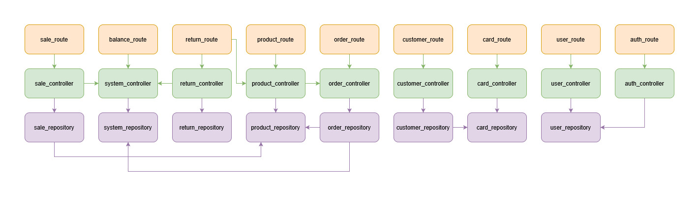
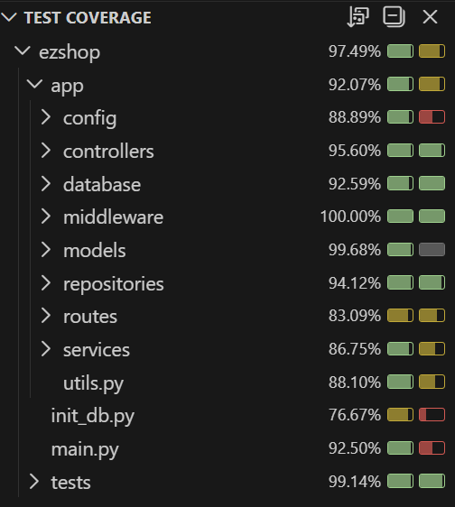

# Test Report

The goal of this document is to explain how the application was tested, detailing how the test cases were defined and what they cover

# Contents

- [Test Report](#test-report)
- [Contents](#contents)
- [Dependency graph](#dependency-graph)
- [Integration approach](#integration-approach)
- [Tests](#tests)
- [Coverage](#coverage)
  - [Coverage of FR](#coverage-of-fr)
  - [Coverage white box](#coverage-white-box)

# Dependency graph

  

# Integration approach

## Balance tests

Integration strategy: **Bottom-up approach**

- **Step 1 (Unit testing)**: SystemRepository
  - Mocked database session
  - Tests low-level repository methods for getting and setting balance

- **Step 2 (Integration testing)**: SystemRepository + SystemController
  - Real database (reset between tests)
  - Tests controller integration with repository layer
  - Verifies balance operations through controller interface

- **Step 3 (System/API testing)**: Full stack (Controller + Repository + Database + Routes)
  - Uses TestClient to call REST API endpoints
  - Tests complete HTTP flow with authentication
  - Verifies system behavior at API level

## Returns tests

Integration strategy: **Bottom-up approach**

- **Step 1: Unit Testing (`ReturnRepository`)**: In this phase, individual repository methods were tested in isolation. **Mocking** techniques were used to simulate SQLAlchemy database sessions.
    
- **Step 2: Integration Testing (`ReturnController`)**: Integration tests focused on the interaction between the controller and a real database (SQLite). In each test, the database was reset and reinitialized to ensure execution independence.
    
- **Step 3: System/API Testing (`FastAPI/TestClient`)**: The final step involved testing the entire system through simulated HTTP requests. In addition to end-to-end functional flows, security constraints related to user roles (Admin, ShopManager, Cashier) were tested via JWT tokens. In order to properly enable and validate return-related tests, the APIs for customers, sales, balance, and system management were also invoked, as these components are required for the correct execution of return operations.

## Sales tests

Integration strategy: **Bottom-up approach**

- **Step 1 (Unit Testing)**: Individual components were tested in isolation using a White Box approach with Simple Decision Coverage:
   - **Mapper Service**: Tested directly without the need for mocks.
   - **Repository**: Tested in isolation by mocking calls to the `ProductRepository` and the underlying database.
   - **Controller**: Tested in isolation by creating stubs (mocks) for functions related to `SaleRepository` and `SystemController`.

- **Step 2 (Integration testing)**: Focused on specific Controller functions (`create_sale`, `list_sales`, `get_sale`). In this step, calls to the Repository remained mocked, but the interaction with the **Mapper Service** (`sale_dao_to_dto`) was real (no mocks), verifying the correct integration between Controller and Mapper. The technique used remained White Box with Simple Decision Coverage.

- **Step 3 (System/API testing)**: The full system was tested at the Route level using a Black Box approach, specifically applying Equivalence Class Partitioning.

## Customers tests

Integration strategy: **Bottom-up approach**

- **Step 1 (Unit Testing)**: CardRepository (in isolation)
  - Real database with reset/init between tests
  - Tests repository methods for CRUD operations on cards

- **Step 2 (Integration Testing)**: CardRepository + CardController
  - Real database with reset/init between tests
  - Tests controller orchestration with card repository
  - Verifies card management business logic

- **Step 3 (Integration Testing)**: CardRepository + CustomerRepository
  - Real database with reset/init between tests
  - Tests CustomerRepository with its dependencies to CardRepository
  - Tests repository methods for CRUD operations on customers

- **Step 4 (Integration Testing)**: CardRepository + CustomerRepository + CustomerController
  - Real database with reset/init between tests
  - Tests controller orchestration with customer and card repository
  - Verifies customer management business logic

- **Step 5 (System/API Testing)**: Full stack (All layers + Routes + HTTP)
  - Uses TestClient for HTTP API testing
  - Tests complete workflows with authentication
  - Verifies customer and card operations through REST endpoints

## Products test

Integration strategy: **Bottom-up approach**

- **Step 1 (Unit testing)**: In this phase, individual repository methods were tested in isolation. **Mocking** techniques were used to simulate SQLAlchemy database sessions, allowing for the verification of barcode validation logic (GTIN checksum algorithm), proper exception handling (e.g., `NotFoundError`, `ConflictError`), and data integrity at an atomic level.
    
- **Step 2 (Integration testing)**: Integration tests focused on the interaction between the controller and a real database (SQLite). In each test, the database was reset and reinitialized to ensure execution independence. Complex business logic was verified, such as checking for position conflicts (two products in the same location) and the secure incrementing/decrementing of operation counters (`involvedOperations`).
    
- **Step 3 (System/API testing)**: The final step involved testing the entire system through simulated HTTP requests. In addition to end-to-end functional flows, security constraints related to user roles (Admin, ShopManager, Cashier) were tested via JWT tokens. Product "locked" states were also verified, preventing, for example, barcode modification or deletion if the product is associated with an open sale.
    
## Orders tests

Integration strategy: **Bottom-up approach**

- **Step 1 (Unit Testing)**: OrderRepository, ProductRepository, SystemRepository (in isolation)
  - Real database with reset/init between tests
  - Tests repository methods for CRUD operations on orders
  - Each test operates independently with mocked dependencies

- **Step 2 (Integration Testing)**: OrderRepository + OrderController + ProductRepository
  - Real database
  - Tests controller orchestration with multiple repositories
  - Verifies order state transitions and business logic

- **Step 3 (System/API Testing)**: Full stack (All layers + Routes + HTTP)
  - Uses TestClient for HTTP API testing
  - Tests complete workflows with authentication
  - Verifies order operations through REST endpoints

# Tests

## Balance tests

| Test case name | Object(s) tested | Test level | Technique used |
| :------------ | :-------------- | :--------: | :------------ |
| test_get_balance_success | SystemRepository.get_last_system_info() | Unit | WB: Mocking + Statement coverage |
| test_get_balance_no_system_info | SystemRepository.get_last_system_info() | Unit | WB: Boundary value (None case) |
| test_get_balance_session_error | SystemRepository.get_last_system_info() | Unit | WB: Error handling |
| test_create_system_info_success | SystemRepository.create_system_info() | Unit | WB: Statement coverage + Mocking |
| test_create_system_info_zero_balance | SystemRepository.create_system_info() | Unit | BB: Boundary value (zero) |
| test_create_system_info_negative_balance | SystemRepository.create_system_info() | Unit | BB: Equivalence class (negative) |
| test_create_system_info_failure | SystemRepository.create_system_info() | Unit | WB: Exception handling |
| test_get_balance_success | SystemController.get_balance() | Integration | BB: Equivalence class + Integration testing |
| test_get_balance_zero_value | SystemController.get_balance() | Integration | BB: Boundary value (zero) |
| test_get_balance_not_found | SystemController.get_balance() | Integration | BB: Exception case |
| test_set_balance_success | SystemController.set_balance() | Integration | BB: Valid input + Integration testing |
| test_set_balance_zero | SystemController.set_balance() | Integration | BB: Boundary value (zero) |
| test_set_balance_negative_raises_error | SystemController.set_balance() | Integration | BB: Exception case (negative) |
| test_reset_balance_success | SystemController.reset_balance() | Integration | BB: State transition verification |
| test_get_balance_success | REST API /balance GET | System/API | BB: Full stack + API testing |
| test_get_balance_zero | REST API /balance GET | System/API | BB: Boundary value (zero) |
| test_get_balance_positive_amount | REST API /balance GET | System/API | BB: Equivalence class (positive) |
| test_get_balance_returns_latest | REST API /balance GET | System/API | WB: State consistency |
| test_get_balance_unauthenticated | REST API /balance GET | System/API | BB: Authorization error |
| test_get_balance_without_header | REST API /balance GET | System/API | BB: Missing header error |
| test_get_balance_invalid_token | REST API /balance GET | System/API | BB: Invalid credentials |
| test_get_balance_in_complete_workflow | REST API Balance workflow | System/API | WB: End-to-end scenario |
| test_get_balance_consistency | REST API /balance GET | System/API | WB: Consistency verification |
| test_set_balance_success | REST API /balance/set POST | System/API | BB: Valid input + API testing |
| test_set_balance_zero | REST API /balance/set POST | System/API | BB: Boundary value (zero) |
| test_set_balance_negative_rejected | REST API /balance/set POST | System/API | BB: Invalid input (negative) |
| test_set_balance_then_get | REST API Balance workflow | System/API | WB: Integration verification |
| test_set_balance_overwrites_previous | REST API /balance/set POST | System/API | WB: State overwrite |

## Returns tests

| Test case name | Object(s) tested | Test level | Technique used |
| :------------ | :-------------- | :--------: | :------------ |
| return_repository_add_item_test | ReturnRepository.add_item | Unit | WB: Multiple Condition Coverage |
| return_repository_close_return_test | ReturnRepository.close_return | Unit | WB: Multiple Condition Coverage |
| return_repository_delete_transaction_test | ReturnRepository.delete_return | Unit | WB: Multiple Condition Coverage |
| return_repository_get_all_returns_test | ReturnRepository.get_all_returns | Unit | WB: Multiple Condition Coverage |
| return_repository_get_return_by_id_test | ReturnRepository.get_return_by_id | Unit | WB: Multiple Condition Coverage |
| return_repository_get_return_by_sale_id_test | ReturnRepository.get_returns_by_sale | Unit | WB: Multiple Condition Coverage |
| return_repository_reimburse_test | ReturnRepository.reimburse_return | Unit | WB: Multiple Condition Coverage |
| return_repository_remove_item_test | ReturnRepository.remove_item | Unit | WB: Multiple Condition Coverage |
| return_repository_start_return_test | ReturnRepository.start_return | Unit | WB: Multiple Condition Coverage |
| return_controller_add_item_test | ReturnController.add_item | Integration | WB: Multiple Condition Coverage |
| return_controller_close_return_test | ReturnController.close_return | Integration | WB: Multiple Condition Coverage |
| return_controller_delete_transaction_test | ReturnController.delete_return | Integration | WB: Multiple Condition Coverage |
| return_controller_get_all_return_test | ReturnController.get_all_returns | Integration | WB: Multiple Condition Coverage |
| return_controller_get_return_by_id_test | ReturnController.get_return_by_id | Integration | WB: Multiple Condition Coverage |
| return_controller_get_return_by_sale_id_test | ReturnController.get_returns_by_sale | Integration | WB: Multiple Condition Coverage |
| return_controller_reimburse_test | ReturnController.reimburse_return | Integration | WB: Multiple Condition Coverage |
| return_controller_remove_item_test | ReturnController.remove_item | Integration | WB: Multiple Condition Coverage |
| return_controller_start_return_test | ReturnController.start_return | Integration | WB: Multiple Condition Coverage |
| return_route_add_item_test | ReturnRoute.add_item | System/API | BB: Equivalence classes partitioning |
| return_route_close_return_test | ReturnRoute.close_return | System/API | BB: Equivalence classes partitioning |
| return_route_delete_transaction_test | ReturnRoute.delete_return | System/API | BB: Equivalence classes partitioning |
| return_route_get_all_returns_test | ReturnRoute.get_all_returns | System/API | BB: Equivalence classes partitioning |
| return_route_get_return_by_id_test | ReturnRoute.get_return_by_id | System/API | BB: Equivalence classes partitioning |
| return_route_get_returns_by_sale_test | ReturnRoute.get_returns_by_sale | System/API | BB: Equivalence classes partitioning |
| return_route_reimburse_test | ReturnRoute.reimburse_return | System/API | BB: Equivalence classes partitioning |
| return_route_remove_item_test | ReturnRoute.remove_item | System/API | BB: Equivalence classes partitioning |
| return_route_start_return_test | ReturnRoute.start_return | System/API | BB: Equivalence classes partitioning |

## Sales tests

| Test case name | Object(s) tested | Test level | Technique used |
| :------------ | :-------------- | :--------: | :------------ |
| test_repository_add_item_to_sale | SaleRepository.add_item_to_sale() | Unit | WB : Decision coverage |
| test_repository_delete_sale | SaleRepository.delete_sale() | Unit | WB : Decision coverage |
| test_repository_remove_item_from_sale | SaleRepository.remove_item_from_sale() | Unit | WB : Decision coverage |
| test_repository_update_sale_discount | SaleRepository.update_sale_discount() | Unit | WB : Decision coverage |
| test_repository_update_sale_line_discount | SaleRepository.update_sale_line_discount() | Unit | WB : Decision coverage |
| test_repository_update_sale_status_paid | SaleRepository.update_sale_status_paid() | Unit | WB : Decision coverage |
| test_repository_update_sale_status_pending | SaleRepository.update_sale_status_pending() | Unit | WB : Decision coverage |
| test_controller_add_item_to_sale | SaleController.add_item_to_sale() | Unit | WB : Decision coverage |
| test_controller_close_sale | SaleController.close_sale() | Unit | WB : Decision coverage |
| test_controller_delete_item_from_sale | SaleController.delete_item_from_sale() | Unit | WB : Decision coverage |
| test_controller_delete_sale | SaleController.delete_sale() | Unit | WB : Decision coverage |
| test_controller_get_sale_points | SaleController.get_sale_points() | Unit | WB : Decision coverage |
| test_controller_process_payment | SaleController.process_payment() | Unit | WB : Decision coverage |
| test_controller_update_sale_discount | SaleController.update_sale_discount() | Unit | WB : Decision coverage |
| test_controller_update_sale_line_discount | SaleController.update_sale_line_discount() | Unit | WB : Decision coverage |
| test_controller_create_sale | SaleController.create_sale() | Integration | WB : Decision coverage |
| test_controller_get_sale | SaleController.get_sale() | Integration | WB : Decision coverage |
| test_controller_list_sales | SaleController.list_sales() | Integration | WB : Decision coverage |
| test_route_add_item_to_sale           | REST API /sales/{sale_id}/items POST | System/API | BB : Equivalence partitioning |
| test_route_close_sale                 | REST API /sales/{sale_id}/close PATCH | System/API | BB : Equivalence partitioning |
| test_route_create_sale                | REST API /sales POST | System/API | BB : Equivalence partitioning |
| test_route_delete_item_from_sale      | REST API /sales/{sale_id}/items DELETE | System/API | BB : Equivalence partitioning |
| test_route_delete_sale                | REST API /sales/{sale_id} DELETE | System/API | BB : Equivalence partitioning |
| test_route_get_sale                   | REST API /sales/{sale_id} GET | System/API | BB : Equivalence partitioning |
| test_route_get_sale_points            | REST API /sales/{sale_id}/points GET | System/API | BB : Equivalence partitioning |
| test_route_list_sales                 | REST API /sales GET | System/API | BB : Equivalence partitioning |
| test_route_payment                    | REST API /sales/{sale_id}/pay PATCH | System/API | BB : Equivalence partitioning |
| test_route_update_sale_discount       | REST API /sales/{sale_id}/discount PATCH | System/API | BB : Equivalence partitioning |
| test_route_update_sale_line_discount  | REST API /sales/{sale_id}/items/{product_barcode}/discount PATCH | System/API | BB : Equivalence partitioning |

## Customers test

| Test case name | Object(s) tested | Test level | Technique used |
| :------------ | :-------------- | :--------: | :------------ |
| card_repository_test.test_create_card() | CardRepository.create_card() | Unit | WB : Decision coverage |
| card_repository_test.test_get_card_success() | CardRepository.get_card() | Unit | WB : Decision coverage |
| card_repository_test.test_get_card_not_found() | CardRepository.get_card() | Unit | WB : Decision coverage |
| card_repository_test.test_update_card_success() | CardRepository.update_card() | Unit | WB : Decision coverage |
| card_repository_test.test_update_card_not_found() | CardRepository.update_card() | Unit | WB : Decision coverage |
| card_repository_test.test_update_card_without_sum_success() | CardRepository.update_card_without_sum() | Unit | WB : Decision coverage |
| card_repository_test.test_update_card_without_sum_not_found() | CardRepository.update_card_without_sum() | Unit | WB : Decision coverage |
| card_repository_test.test_delete_card_success() | CardRepository.delete_card() | Unit | WB : Decision coverage |
| card_repository_test.test_delete_card_not_found() | CardRepository.delete_card() | Unit | WB : Decision coverage |
| card_repository_test.test_update_and_attach_to_customer_success() | CardRepository.update_and_attach_card_to_customer() | Unit | WB : Decision coverage |
| card_repository_test.test_update_and_attach_to_customer_not_found() | CardRepository.update_and_attach_card_to_customer() | Unit | WB : Decision coverage |
| card_repository_test.test_is_attached_success() | CardRepository.is_attached() | Unit | WB : Decision coverage |
| card_repository_test.test_is_attached_not_found() | CardRepository.is_attached() | Unit | WB : Decision coverage |
| card_repository_test.test_get_card_by_customer_success() | CardRepository.get_card_by_customer() | Unit | WB : Decision coverage |
| card_repository_test.test_get_card_by_customer_not_found() | CardRepository.get_card_by_customer() | Unit | WB : Decision coverage |
| customer_repository_test.test_create_customer() | CustomerRepository.create_customer() | Integration | WB : Decision coverage |
| customer_repository_test.test_get_customer_success() | CustomerRepository.get_customer() | Integration | WB : Decision coverage |
| customer_repository_test.test_get_customer_not_found() | CustomerRepository.get_customer() | Integration | WB : Decision coverage |
| customer_repository_test.test_list_customers_empty() | CustomerRepository.list_customers() | Integration | WB : Decision coverage |
| customer_repository_test.test_list_customers_success() | CustomerRepository.list_customers() | Integration | WB : Decision coverage |
| customer_repository_test.test_attach_card_to_customer_not_found() | CustomerRepository.attach_card_to_customer() | Integration | WB : Decision coverage |
| customer_repository_test.test_attach_card_to_customer_conflict() | CustomerRepository.attach_card_to_customer() | Integration | WB : Decision coverage |
| customer_repository_test.test_attach_card_to_customer_card_switch() | CustomerRepository.attach_card_to_customer() | Integration | WB : Decision coverage |
| customer_repository_test.test_update_customer_without_card() | CustomerRepository.update_customer() | Integration | WB : Decision coverage |
| customer_repository_test.test_update_customer_not_found() | CustomerRepository.update_customer() | Integration | WB : Decision coverage |
| customer_repository_test.test_update_customer_with_card() | CustomerRepository.update_customer() | Integration | WB : Decision coverage |
| customer_repository_test.test_update_customer_empty_card() | CustomerRepository.update_customer() | Integration | WB : Decision coverage |
| customer_repository_test.test_update_customer_conflict() | CustomerRepository.update_customer() | Integration | WB : Decision coverage |
| customer_repository_test.test_update_customer_invalid_card() | CustomerRepository.update_customer() | Integration | WB : Decision coverage |
| customer_repository_test.test_delete_customer_without_card() | CustomerRepository.update_customer() | Integration | WB : Decision coverage |
| customer_repository_test.test_delete_customer_not_found() | CustomerRepository.update_customer() | Integration | WB : Decision coverage |
| customer_repository_test.test_delete_customer_with_card() | CustomerRepository.update_customer() | Integration | WB : Decision coverage |
| card_controller_test.test_create_card() | CardController.create_card() | Integration | WB : Decision coverage |
| card_controller_test.test_get_card() | CardController.get_card() | Integration | WB : Decision coverage |
| card_controller_test.test_modify_card_points() | CardController.modify_points_card() | Integration | WB : Decision coverage |
| customer_controller_test.test_create_customer() | CustomerController.create_customer() | Integration | WB : Decision coverage |
| customer_controller_test.test_get_customer_success() | CustomerController.get_customer() | Integration | WB : Decision coverage |
| customer_controller_test.test_get_customer_not_found() | CustomerController.get_customer() | Integration | WB : Decision coverage |
| customer_controller_test.test_list_customers_empty() | CustomerController.list_customers() | Integration | WB : Decision coverage |
| customer_controller_test.test_list_customers_success() | CustomerController.list_customers() | Integration | WB : Decision coverage |
| customer_controller_test.test_attach_card_to_customer_not_found() | CustomerController.attach_card_to_customer() | Integration | WB : Decision coverage |
| customer_controller_test.test_attach_card_to_customer_conflict() | CustomerController.attach_card_to_customer() | Integration | WB : Decision coverage |
| customer_controller_test.test_attach_card_to_customer_card_switch() | CustomerController.attach_card_to_customer() | Integration | WB : Decision coverage |
| customer_controller_test.test_update_customer_without_card() | CustomerController.update_customer() | Integration | WB : Decision coverage |
| customer_controller_test.test_update_customer_not_found() | CustomerController.update_customer() | Integration | WB : Decision coverage |
| customer_controller_test.test_update_customer_with_card() | CustomerController.update_customer() | Integration | WB : Decision coverage |
| customer_controller_test.test_update_customer_empty_card() | CustomerController.update_customer() | Integration | WB : Decision coverage |
| customer_controller_test.test_update_customer_conflict() |  CustomerController.update_customer()| Integration | WB : Decision coverage |
| customer_controller_test.test_update_customer_invalid_card() | CustomerController.update_customer() | Integration | WB : Decision coverage |
| customer_controller_test.test_delete_customer_without_card() | CustomerController.delete_customer() | Integration | WB : Decision coverage |
| customer_controller_test.test_delete_customer_not_fount() | CustomerController.delete_customer() | Integration | WB : Decision coverage |
| customer_controller_test.test_delete_customer_without_card() | CustomerController.delete_customer() | Integration | WB : Decision coverage |
| customer_test.test_create_card_success_as_admin() | REST API /customers/cards POST | System/API | BB : Equivalence partitioning |
| customer_test.test_create_card_success_as_cashier() | REST API /customers/cards POST | System/API | BB : Equivalence partitioning |
| customer_test.test_create_card_success_as_manager() | REST API /customers/cards POST | System/API | BB : Equivalence partitioning |
| customer_test.test_create_card_unauthenticated() | REST API /customers/cards POST | System/API | BB : Equivalence partitioning |
| customer_test.test_create_customer_success_as_admin() | REST API /customers POST | System/API | BB : Equivalence partitioning |
| customer_test.test_create_customer_success_as_cashier() | REST API /customers POST | System/API | BB : Equivalence partitioning |
| customer_test.test_create_customer_success_as_manager() | REST API /customers POST | System/API | BB : Equivalence partitioning |
| customer_test.test_create_multiple_customers() | REST API /customers POST | System/API | BB : Equivalence partitioning |
| customer_test.test_create_customer_missing_fields() | REST API /customers POST | System/API | BB : Equivalence partitioning |
| customer_test.test_create_customer_with_card() | REST API /customers POST | System/API | BB : Equivalence partitioning |
| customer_test.test_create_customer_with_invalid_card() | REST API /customers POST | System/API | BB : Equivalence partitioning |
| customer_test.test_create_customer_with_wrong_card() | REST API /customers POST | System/API | BB : Equivalence partitioning |
| customer_test.test_create_customer_card_conflict() | REST API /customers POST | System/API | BB : Equivalence partitioning |
| customer_test.test_create_customer_unauthenticated() | REST API /customers POST | System/API | BB : Equivalence partitioning |
| customer_test.test_list_customers_success_as_admin() | REST API /customers GET | System/API | BB : Equivalence partitioning |
| customer_test.test_list_customers_success_as_cashier() | REST API /customers GET | System/API | BB : Equivalence partitioning |
| customer_test.test_list_customers_success_as_manager() | REST API /customers GET | System/API | BB : Equivalence partitioning |
| customer_test.test_list_customers_empty() | REST API /customers GET | System/API | BB : Equivalence partitioning |
| customer_test.test_list_customers_not_empty() | REST API /customers GET | System/API | BB : Equivalence partitioning |
| customer_test.test_list_customers_unauthenticated() | REST API /customers GET | System/API | BB : Equivalence partitioning |
| customer_test.test_get_customer_success_as_admin() | REST API /customers/{customer_id} GET | System/API | BB : Equivalence partitioning |
| customer_test.test_get_customer_success_as_cashier() | REST API /customers/{customer_id} GET | System/API | BB : Equivalence partitioning |
| customer_test.test_get_customer_success_as_manager() | REST API /customers/{customer_id} GET | System/API | BB : Equivalence partitioning |
| customer_test.test_get_customer_invalid_id() | REST API /customers/{customer_id} GET | System/API | BB : Equivalence partitioning |
| customer_test.test_get_customer_not_found() | REST API /customers/{customer_id} GET | System/API | BB : Equivalence partitioning |
| customer_test.test_get_customer_unauthenticated() | REST API /customers/{customer_id} GET | System/API | BB : Equivalence partitioning |
| customer_test.test_update_customer_success_as_admin() | REST API /customers/{customer_id} PUT | System/API | BB : Equivalence partitioning |
| customer_test.test_update_customer_success_as_cashier() | REST API /customers/{customer_id} PUT | System/API | BB : Equivalence partitioning |
| customer_test.test_update_customer_success_as_manager() | REST API /customers/{customer_id} PUT | System/API | BB : Equivalence partitioning |
| customer_test.test_update_customer_invalid_customer() | REST API /customers/{customer_id} PUT | System/API | BB : Equivalence partitioning |
| customer_test.test_update_customer_not_found() | REST API /customers/{customer_id} PUT | System/API | BB : Equivalence partitioning |
| customer_test.test_update_customer_with_card_success() | REST API /customers/{customer_id} PUT | System/API | BB : Equivalence partitioning |
| customer_test.test_update_customer_invalid_card() | REST API /customers/{customer_id} PUT | System/API | BB : Equivalence partitioning |
| customer_test.test_update_customer_card_not_found() | REST API /customers/{customer_id} PUT | System/API | BB : Equivalence partitioning |
| customer_test.test_update_customer_empty_card() | REST API /customers/{customer_id} PUT | System/API | BB : Equivalence partitioning |
| customer_test.test_update_customer_empty_card_1() | REST API /customers/{customer_id} PUT | System/API | BB : Equivalence partitioning |
| customer_test.test_update_customer_change_card() |  REST API /customers/{customer_id} PUT| System/API | BB : Equivalence partitioning |
| customer_test.test_update_customer_conflict() | REST API /customers/{customer_id} PUT | System/API | BB : Equivalence partitioning |
| customer_test.test_update_customer_with_card_negative_points() | REST API /customers/{customer_id} PUT | System/API | BB : Equivalence partitioning |
| customer_test.test_update_customer_unauthenticated() | REST API /customers/{customer_id} PUT | System/API | BB : Equivalence partitioning |
| customer_test.test_delete_customer_success_as_admin() | REST API /customers/{customer_id} DELETE | System/API | BB : Equivalence partitioning |
| customer_test.test_delete_customer_success_as_cashier() | REST API /customers/{customer_id} DELETE | System/API | BB : Equivalence partitioning |
| customer_test.test_delete_customer_success_as_manager() | REST API /customers/{customer_id} DELETE | System/API | BB : Equivalence partitioning |
| customer_test.test_delete_customer_not_found() | REST API /customers/{customer_id} DELETE | System/API | BB : Equivalence partitioning |
| customer_test.test_delete_customer_unauthenticated() | REST API /customers/{customer_id} DELETE | System/API | BB : Equivalence partitioning |
| customer_test.test_attach_card_to_customer_success_as_admin() | REST API /customers/cards PATCH | System/API | BB : Equivalence partitioning |
| customer_test.test_attach_card_to_customer_success_as_cashier() | REST API /customers/cards PATCH | System/API | BB : Equivalence partitioning |
| customer_test.test_attach_card_to_customer_success_as_manager() | REST API /customers/cards PATCH | System/API | BB : Equivalence partitioning |
| customer_test.test_attach_card_to_customer_invalid_customer() | REST API /customers/cards PATCH | System/API | BB : Equivalence partitioning |
| customer_test.test_attach_card_to_customer_invalid_card() | REST API /customers/cards PATCH | System/API | BB : Equivalence partitioning |
| customer_test.test_attach_card_to_customer_card_not_found() | REST API /customers/cards PATCH | System/API | BB : Equivalence partitioning |
| customer_test.test_attach_card_to_customer_customer_not_found() | REST API /customers/cards PATCH | System/API | BB : Equivalence partitioning |
| customer_test.test_attach_card_to_customer_card_already_attached() | REST API /customers/cards PATCH | System/API | BB : Equivalence partitioning |
| customer_test.test_attach_card_to_customer_twice() | REST API /customers/cards PATCH | System/API | BB : Equivalence partitioning |
| customer_test.test_attach_card_to_customer_customer_already_has_card() | REST API /customers/cards PATCH | System/API | BB : Equivalence partitioning |
| customer_test.test_attach_card_to_customer_customer_unauthenticated() | REST API /customers/cards PATCH | System/API | BB : Equivalence partitioning |
| customer_test.test_modify_card_points_success_as_admin() | REST API /customers/cards/{card_id} PATCH | System/API | BB : Equivalence partitioning |
| customer_test.test_modify_card_points_success_as_cashier() | REST API /customers/cards/{card_id} PATCH | System/API | BB : Equivalence partitioning |
| customer_test.test_modify_card_points_success_as_manager() | REST API /customers/cards/{card_id} PATCH | System/API | BB : Equivalence partitioning |
| customer_test.test_modify_card_points_invalid_id() | REST API /customers/cards/{card_id} PATCH | System/API | BB : Equivalence partitioning |
| customer_test.test_modify_card_points_card_not_found() | REST API /customers/cards/{card_id} PATCH | System/API | BB : Equivalence partitioning |
| customer_test.test_modify_card_points_insufficient_points() | REST API /customers/cards/{card_id} PATCH | System/API | BB : Equivalence partitioning |
| customer_test.test_modify_card_points_unauthenticated() | REST API /customers/cards/{card_id} PATCH | System/API | BB : Equivalence partitioning |

## Products tests

| Test case name | Object(s) tested | Test level | Technique used |
| --- | --- | --- | --- |
| **test_update_product_invalid_data** | ProductRepository.update_product() | Unit | BB: Boundary Value Analysis |
| **test_update_product_simple_fields** | ProductRepository.update_product() | Unit | BB: Equivalence Partitioning |
| **test_update_product_not_found** | ProductRepository.update_product() | Unit | BB: Equivalence Partitioning |
| **test_update_barcode_success** | ProductRepository.update_product() | Unit | BB: Equivalence Partitioning |
| **test_update_barcode_conflict** | ProductRepository.update_product() | Unit | BB: Equivalence Partitioning |
| **test_update_barcode_invalid_state** | ProductRepository.update_product() | Unit | BB: Equivalence Partitioning |
| **test_delete_product_success** | ProductRepository.delete_product() | Unit | BB: Equivalence Partitioning |
| **test_delete_product_not_found** | ProductRepository.delete_product() | Unit | BB: Equivalence Partitioning |
| **test_delete_product_invalid_state** | ProductRepository.delete_product() | Unit | BB: Equivalence Partitioning |
| **test_get_product_by_barcode_found** | ProductRepository.get_product_by_barcode() | Unit | BB: Equivalence Partitioning |
| **test_get_product_by_barcode_not_found** | ProductRepository.get_product_by_barcode() | Unit | BB: Equivalence Partitioning |
| **test_get_product_by_barcode_invalid_format** | ProductRepository.get_product_by_barcode() | Unit | BB: Boundary Value Analysis |
| **test_get_product_by_id_found** | ProductRepository.get_product_by_id() | Unit | BB: Equivalence Partitioning |
| **test_get_product_by_id_not_found** | ProductRepository.get_product_by_id() | Unit | BB: Equivalence Partitioning |
| **test_include_product_in_op_increment_success** | ProductRepository.include_product_in_op() | Unit | WB: Statement Coverage |
| **test_include_product_in_op_decrement_success** | ProductRepository.include_product_in_op() | Unit | WB: Statement Coverage |
| **test_include_product_in_op_decrement_below_zero** | ProductRepository.include_product_in_op() | Unit | BB: Boundary Value Analysis |
| **test_include_product_in_op_not_found** | ProductRepository.include_product_in_op() | Unit | BB: Equivalence Partitioning |
| **test_is_position_free_yes** | ProductRepository.is_position_free() | Unit | BB: Equivalence Partitioning |
| **test_is_position_free_no** | ProductRepository.is_position_free() | Unit | BB: Equivalence Partitioning |
| **test_is_position_free_invalid_format** | ProductRepository.is_position_free() | Unit | BB: Boundary Value Analysis |
| **test_list_products_populated** | ProductRepository.list_products() | Unit | BB: Equivalence Partitioning |
| **test_list_products_empty** | ProductRepository.list_products() | Unit | BB: Equivalence Partitioning |
| **test_create_product_success** | ProductController.create_product() | Integration | BB: Equivalence Partitioning |
| **test_create_product_defaults_valid** | ProductController.create_product() | Integration | BB: Equivalence Partitioning |
| **test_create_product_invalid_barcode** | ProductController.create_product() | Integration | BB: Boundary Value Analysis |
| **test_create_product_invalid_position_format** | ProductController.create_product() | Integration | BB: Boundary Value Analysis |
| **test_create_product_conflict_position** | ProductController.create_product() | Integration | BB: Equivalence Partitioning |
| **test_create_product_conflict_barcode** | ProductController.create_product() | Integration | BB: Equivalence Partitioning |
| **test_delete_product_success** | ProductController.delete_product() | Integration | BB: Equivalence Partitioning |
| **test_delete_product_not_found** | ProductController.delete_product() | Integration | BB: Equivalence Partitioning |
| **test_delete_product_invalid_state** | ProductController.delete_product() | Integration | BB: Equivalence Partitioning |
| **test_exclude_product_from_op_success** | ProductController.exclude_product_from_op() | Integration | WB: Statement Coverage |
| **test_exclude_product_from_op_success_to_zero** | ProductController.exclude_product_from_op() | Integration | WB: Statement Coverage |
| **test_exclude_product_from_op_bad_request** | ProductController.exclude_product_from_op() | Integration | BB: Boundary Value Analysis |
| **test_exclude_product_from_op_not_found** | ProductController.exclude_product_from_op() | Integration | BB: Equivalence Partitioning |
| **test_get_product_by_barcode_success** | ProductController.get_product_by_barcode() | Integration | BB: Equivalence Partitioning |
| **test_get_product_by_barcode_not_found** | ProductController.get_product_by_barcode() | Integration | BB: Equivalence Partitioning |
| **test_get_product_by_barcode_invalid_format** | ProductController.get_product_by_barcode() | Integration | BB: Boundary Value Analysis |
| **test_get_product_by_id_success** | ProductController.get_product_by_id() | Integration | BB: Equivalence Partitioning |
| **test_get_product_by_id_not_found** | ProductController.get_product_by_id() | Integration | BB: Equivalence Partitioning |
| **test_search_by_description_partial_match** | ProductController.get_products_by_description() | Integration | BB: Equivalence Partitioning |
| **test_search_by_description_case_insensitive** | ProductController.get_products_by_description() | Integration | BB: Equivalence Partitioning |
| **test_search_by_description_no_match** | ProductController.get_products_by_description() | Integration | BB: Equivalence Partitioning |
| **test_search_by_description_empty_db** | ProductController.get_products_by_description() | Integration | BB: Equivalence Partitioning |
| **test_list_products_empty** | ProductController.list_products() | Integration | BB: Equivalence Partitioning |
| **test_list_products_populated** | ProductController.list_products() | Integration | BB: Equivalence Partitioning |
| **test_increment_quantity_add_success** | ProductController.increment_product_quantity() | Integration | WB: Statement Coverage |
| **test_increment_quantity_subtract_success** | ProductController.increment_product_quantity() | Integration | WB: Statement Coverage |
| **test_increment_quantity_not_found** | ProductController.increment_product_quantity() | Integration | BB: Equivalence Partitioning |
| **test_increment_quantity_bad_request_negative_result** | ProductController.increment_product_quantity() | Integration | BB: Boundary Value Analysis |
| **test_move_product_success** | ProductController.move_product() | Integration | BB: Equivalence Partitioning |
| **test_move_product_reset_position** | ProductController.move_product() | Integration | BB: Equivalence Partitioning |
| **test_move_product_not_found** | ProductController.move_product() | Integration | BB: Equivalence Partitioning |
| **test_move_product_conflict** | ProductController.move_product() | Integration | BB: Equivalence Partitioning |
| **test_move_product_invalid_format** | ProductController.move_product() | Integration | BB: Boundary Value Analysis |
| **test_update_product_success** | ProductController.update_product() | Integration | BB: Equivalence Partitioning |
| **test_update_product_move_position_success** | ProductController.update_product() | Integration | BB: Equivalence Partitioning |
| **test_update_product_reset_position** | ProductController.update_product() | Integration | BB: Equivalence Partitioning |
| **test_update_product_not_found** | ProductController.update_product() | Integration | BB: Equivalence Partitioning |
| **test_update_product_conflict_position** | ProductController.update_product() | Integration | BB: Equivalence Partitioning |
| **test_update_product_bad_request_quantity** | ProductController.update_product() | Integration | BB: Boundary Value Analysis |
| **test_assign_position_lifecycle** | REST API /products/{id}/position PATCH | System/API | BB: Scenario Testing |
| **test_assign_position_conflict** | REST API /products/{id}/position PATCH | System/API | BB: Equivalence Partitioning |
| **test_assign_position_forbidden_cashier** | REST API /products/{id}/position PATCH | System/API | BB: Access Control |
| **test_assign_position_not_found** | REST API /products/{id}/position PATCH | System/API | BB: Equivalence Partitioning |
| **test_assign_position_invalid_format** | REST API /products/{id}/position PATCH | System/API | BB: Boundary Value Analysis |
| **test_assign_position_invalid_id** | REST API /products/{id}/position PATCH | System/API | BB: Boundary Value Analysis |
| **test_assign_position_unauthenticated** | REST API /products/{id}/position PATCH | System/API | BB: Access Control |
| **test_create_product_success_valid_gtin_and_position** | REST API /products POST | System/API | BB: Equivalence Partitioning |
| **test_create_product_insufficient_permissions** | REST API /products POST | System/API | BB: Access Control |
| **test_create_product_invalid_input** | REST API /products POST | System/API | BB: Boundary Value Analysis |
| **test_create_product_conflict_duplicate_barcode** | REST API /products POST | System/API | BB: Equivalence Partitioning |
| **test_delete_product_success** | REST API /products/{id} DELETE | System/API | BB: Equivalence Partitioning |
| **test_delete_product_forbidden_cashier** | REST API /products/{id} DELETE | System/API | BB: Access Control |
| **test_delete_product_not_found** | REST API /products/{id} DELETE | System/API | BB: Equivalence Partitioning |
| **test_delete_product_invalid_id** | REST API /products/{id} DELETE | System/API | BB: Boundary Value Analysis |
| **test_delete_product_invalid_state_transaction_exists** | REST API /products/{id} DELETE | System/API | BB: Equivalence Partitioning |
| **test_delete_product_unauthenticated** | REST API /products/{id} DELETE | System/API | BB: Access Control |
| **test_get_by_barcode_success** | REST API /products/barcode/{barcode} GET | System/API | BB: Equivalence Partitioning |
| **test_get_by_barcode_forbidden_cashier** | REST API /products/barcode/{barcode} GET | System/API | BB: Access Control |
| **test_get_by_barcode_not_found** | REST API /products/barcode/{barcode} GET | System/API | BB: Equivalence Partitioning |
| **test_get_by_barcode_bad_request** | REST API /products/barcode/{barcode} GET | System/API | BB: Boundary Value Analysis |
| **test_get_by_barcode_unauthenticated** | REST API /products/barcode/{barcode} GET | System/API | BB: Access Control |
| **test_get_by_barcode_missing_barcode_param** | REST API /products/barcode/ GET | System/API | BB: Boundary Value Analysis |
| **test_get_product_by_id_success** | REST API /products/{id} GET | System/API | BB: Equivalence Partitioning |
| **test_get_product_by_id_not_found** | REST API /products/{id} GET | System/API | BB: Equivalence Partitioning |
| **test_get_product_by_id_bad_request_invalid_id** | REST API /products/{id} GET | System/API | BB: Boundary Value Analysis |
| **test_get_product_by_id_unauthenticated** | REST API /products/{id} GET | System/API | BB: Access Control |
| **test_increment_quantity_success** | REST API /products/{id}/quantity PATCH | System/API | BB: Statement Coverage |
| **test_decrement_quantity_success** | REST API /products/{id}/quantity PATCH | System/API | BB: Statement Coverage |
| **test_decrement_quantity_insufficient_stock** | REST API /products/{id}/quantity PATCH | System/API | BB: Boundary Value Analysis |
| **test_quantity_forbidden_cashier** | REST API /products/{id}/quantity PATCH | System/API | BB: Access Control |
| **test_quantity_not_found** | REST API /products/{id}/quantity PATCH | System/API | BB: Equivalence Partitioning |
| **test_quantity_invalid_id** | REST API /products/{id}/quantity PATCH | System/API | BB: Boundary Value Analysis |
| **test_quantity_unauthenticated** | REST API /products/{id}/quantity PATCH | System/API | BB: Access Control |
| **test_list_products_empty** | REST API /products GET | System/API | BB: Equivalence Partitioning |
| **test_list_products_success_all_roles** | REST API /products GET | System/API | BB: Access Control |
| **test_list_products_unauthenticated** | REST API /products GET | System/API | BB: Access Control |
| **test_search_products_success_partial_match** | REST API /products/search GET | System/API | BB: Equivalence Partitioning |
| **test_search_products_success_single_match** | REST API /products/search GET | System/API | BB: Equivalence Partitioning |
| **test_search_products_no_match** | REST API /products/search GET | System/API | BB: Equivalence Partitioning |
| **test_search_products_forbidden_cashier** | REST API /products/search GET | System/API | BB: Access Control |
| **test_search_products_unauthenticated** | REST API /products/search GET | System/API | BB: Access Control |
| **test_search_products_missing_query_param** | REST API /products/search GET | System/API | BB: Boundary Value Analysis |
| **test_update_product_success** | REST API /products/{id} PUT | System/API | BB: Equivalence Partitioning |
| **test_update_product_forbidden_cashier** | REST API /products/{id} PUT | System/API | BB: Access Control |
| **test_update_product_not_found** | REST API /products/{id} PUT | System/API | BB: Equivalence Partitioning |
| **test_update_product_validation_error** | REST API /products/{id} PUT | System/API | BB: Boundary Value Analysis |
| **test_update_product_invalid_id** | REST API /products/{id} PUT | System/API | BB: Boundary Value Analysis |
| **test_update_product_conflict_barcode** | REST API /products/{id} PUT | System/API | BB: Equivalence Partitioning |
| **test_update_barcode_fails_if_transaction_exists** | REST API /products/{id} PUT | System/API | BB: Scenario Testing |
| **test_update_other_fields_allowed_with_transaction** | REST API /products/{id} PUT | System/API | BB: Scenario Testing |

## Orders tests

| Test case name | Object(s) tested | Test level | Technique used |
| :------------ | :-------------- | :--------: | :------------ |
| test_create_order_success | OrderRepository.create_order() | Unit | WB: Statement coverage + Mocking |
| test_create_order_paid_with_sufficient_balance | OrderRepository.create_order() + SystemRepository | Unit | BB: Equivalence class (sufficient balance) |
| test_create_order_product_not_found | OrderRepository.create_order() | Unit | BB: Exception case |
| test_create_order_insufficient_balance | OrderRepository.create_order() + SystemRepository | Unit | BB: Boundary value (insufficient balance) |
| test_get_order_existing_order | OrderRepository.get_order() | Unit | WB: Statement coverage |
| test_get_order_non_existent_order | OrderRepository.get_order() | Unit | BB: Boundary value (None case) |
| test_get_order_multiple_orders | OrderRepository.get_order() | Unit | WB: Isolation verification |
| test_list_orders_empty | OrderRepository.list_orders() | Unit | BB: Boundary value (empty list) |
| test_list_orders_single_order | OrderRepository.list_orders() | Unit | BB: Equivalence class (single element) |
| test_list_orders_multiple_orders | OrderRepository.list_orders() | Unit | WB: Statement coverage |
| test_create_issued_order_success | OrderController.create_issued_order() | Integration | BB: Valid input + Integration testing |
| test_create_issued_order_with_zero_quantity | OrderController.create_issued_order() | Integration | BB: Boundary value (zero) |
| test_create_issued_order_with_negative_quantity | OrderController.create_issued_order() | Integration | BB: Equivalence class (negative) |
| test_create_issued_order_with_zero_price | OrderController.create_issued_order() | Integration | BB: Boundary value (zero price) |
| test_pay_order_success | OrderController.pay_order() + SystemController | Integration | BB: State transition + Balance deduction |
| test_pay_order_not_found | OrderController.pay_order() | Integration | BB: Exception case |
| test_pay_order_invalid_id_negative | OrderController.pay_order() | Integration | BB: Boundary value (negative ID) |
| test_pay_order_already_paid | OrderController.pay_order() | Integration | BB: Invalid state |
| test_list_orders | OrderController.list_orders() | Integration | WB: Integration verification |
| test_complete_order_success | OrderController.complete_order() | Integration | BB: State transition |
| test_create_issued_order_system_workflow | Full stack + OrderRepository verification | System/API | WB: End-to-end scenario |
| test_create_issued_order_with_product_involvement | OrderController + ProductRepository | System/API | WB: Side effect verification |
| test_create_issued_order_does_not_affect_balance | OrderController + SystemRepository | System/API | WB: State isolation |
| test_pay_order_system_workflow | Full workflow: Create + Pay + Verify | System/API | WB: Complete workflow |
| test_pay_order_deducts_correct_amount | OrderController + SystemController | System/API | BB: Calculation verification |

# Coverage

## Coverage of FR

### Balance

| Functional Requirement or scenario | Test(s) |
| :--------------------------------: | :-----: |
| FR8.4 - Compute balance | test_get_balance_success, test_get_balance_zero_value, test_get_balance_zero, test_get_balance_positive_amount, test_get_balance_returns_latest, test_get_balance_consistency |
| FR8.1 - Record debit | test_set_balance_success, test_set_balance_zero, test_set_balance_then_get, test_set_balance_overwrites_previous |
| FR8.2 - Record credit | test_set_balance_success, test_set_balance_then_get |
| FR8.3 - Show credits and debits over a period | test_get_balance_in_complete_workflow |
| Balance error handling | test_set_balance_negative_rejected, test_get_balance_not_found |
| Authentication & Authorization | test_get_balance_unauthenticated, test_get_balance_without_header, test_get_balance_invalid_token |
| Scenario 9-1 - List credits and debits | test_get_balance_in_complete_workflow, test_get_balance_success |

### Returns

| Functional Requirement or scenario | Test(s) |
| :--------------------------------: | :-----: |
| FR6.12 - Start a return transaction | return_repository_start_return_test, return_controller_start_return_test, return_route_start_return_test |
| FR6.13 - Return a product listed in a sale transaction | return_repository_add_item_test, return_controller_add_item_test, return_route_add_item_test |
| FR6.14 - Close a return transaction | return_repository_close_return_test, return_controller_close_return_test, return_route_close_return_test |
| FR6.15 - Rollback or commit a closed return transaction | return_repository_reimburse_test, return_controller_reimburse_test, return_route_reimburse_test |
| Scenario 8-1 - Return transaction of product type X completed, credit card | return_repository_start_return_test, return_repository_add_item_test, return_repository_reimburse_test, return_repository_close_return_test, return_controller_start_return_test, return_controller_add_item_test, return_controller_reimburse_test, return_controller_close_return_test, return_route_start_return_test, return_route_add_item_test, return_route_reimburse_test, return_route_close_return_test |
| Scenario 8-2 - Return transaction of product type X completed, cash | return_repository_start_return_test, return_repository_add_item_test, return_repository_reimburse_test, return_repository_close_return_test, return_controller_start_return_test, return_controller_add_item_test, return_controller_reimburse_test, return_controller_close_return_test, return_route_start_return_test, return_route_add_item_test, return_route_reimburse_test, return_route_close_return_test |

### Sales

| Functional Requirement or scenario | Test(s) |
| :--------------------------------: | :-----: |
|                FR6.1 - Start a sale             |   test_route_create_sale, test_controller_create_sale  |
|                FR6.2 - Add a product to a sale             |   test_route_add_item_to_sale, test_controller_add_item_to_sale, test_repository_add_item_to_sale |
|                FR6.3 - Delete a product from a sale             |   test_route_delete_item_from_sale, test_controller_delete_item_from_sale, test_repository_remove_item_from_sale  |
|                FR6.4 - Apply discount rate to a sale             |   test_route_update_sale_discount, test_controller_update_sale_discount, test_repository_update_sale_discount      |
|                FR6.5 - Apply discount rate to a product type             |   test_route_update_sale_line_discount, test_controller_update_sale_line_discount, test_repository_update_sale_line_discount      |
|                FR6.6 - Compute points for a sale             |   test_route_get_sale_points, test_controller_get_sale_points      |
|                FR6.10 - Close a sale transaction            |   test_route_close_sale, test_controller_close_sale, test_repository_update_sale_status_pending       |
|                FR6.11 - Rollback or commit a closed sale transaction            |   test_route_delete_sale, test_controller_delete_sale, test_repository_delete_sale      |
|                FR7.1 - Receive payment cash             |   test_route_payment, test_controller_process_payment, test_repository_update_sale_status_paid      |
|                Scenario 6-1        |   test_route_create_sale, test_controller_create_sale, test_route_add_item_to_sale, test_controller_add_item_to_sale, test_repository_add_item_to_sale, test_route_close_sale, test_controller_close_sale, test_repository_update_sale_status_pending      |
|                Scenario 6-2        |   test_route_create_sale, test_controller_create_sale, test_route_add_item_to_sale, test_controller_add_item_to_sale, test_repository_add_item_to_sale, test_route_update_sale_line_discount, test_controller_update_sale_line_discount, test_repository_update_sale_line_discount, test_route_close_sale, test_controller_close_sale, test_repository_update_sale_status_pending      |
|                Scenario 6-3        |   test_route_create_sale, test_controller_create_sale, test_route_add_item_to_sale, test_controller_add_item_to_sale, test_repository_add_item_to_sale, test_route_update_sale_discount, test_controller_update_sale_discount, test_repository_update_sale_discount, test_route_close_sale, test_controller_close_sale, test_repository_update_sale_status_pending      |
|                Scenario 6-4        |   test_route_create_sale, test_controller_create_sale, test_route_add_item_to_sale, test_controller_add_item_to_sale, test_repository_add_item_to_sale, test_route_close_sale, test_controller_close_sale, test_repository_update_sale_status_pending, test_route_get_sale_points, test_controller_get_sale_points      |
|                Scenario 6-5        |   test_route_create_sale, test_controller_create_sale, test_route_add_item_to_sale, test_controller_add_item_to_sale, test_repository_add_item_to_sale, , test_route_close_sale, test_controller_close_sale, test_repository_update_sale_status_pending, test_route_delete_sale, test_controller_delete_sale, test_repository_delete_sale      |
|                Scenario 6-6        |    test_route_create_sale, test_controller_create_sale, test_route_add_item_to_sale, test_controller_add_item_to_sale, test_repository_add_item_to_sale, test_route_close_sale, test_controller_close_sale, test_repository_update_sale_status_pending      |
|                Scenario 7-4        |   test_route_payment, test_controller_process_payment, test_repository_update_sale_status_paid      |

### Customers

| Functional Requirement or scenario | Test(s) |
| :--------------------------------: | :-----: |
|                FR5.1 - Define or modify a customer              |    customer_test.test_create_customer_success_as_admin(), customer_test.test_create_customer_success_as_cashier(), customer_test.test_create_customer_success_as_manager(), customer_test.test_create_multiple_customers(), customer_test.test_create_customer_missing_fields(), customer_test.test_create_customer_with_card(), customer_test.test_create_customer_with_invalid_card(), customer_test.test_create_customer_with_wrong_card(), customer_test.test_create_customer_card_conflict(), customer_test.test_create_customer_unauthenticated(), customer_test.test_update_customer_success_as_admin(), customer_test.test_update_customer_success_as_cashier(), customer_test.test_update_customer_success_as_manager(), customer_test.test_update_customer_invalid_customer(), customer_test.test_update_customer_not_found(), customer_test.test_update_customer_with_card_success(), customer_test.test_update_customer_invalid_card(), customer_test.test_update_customer_card_not_found(), customer_test.test_update_customer_empty_card(), customer_test.test_update_customer_empty_card_1(), customer_test.test_update_customer_change_card(), customer_test.test_update_customer_conflict(), customer_test.test_update_customer_with_card_negative_points(), customer_test.test_update_customer_unauthenticated()      |
|                FR5.2 - Delete a customer              |    customer_test.test_delete_customer_success_as_admin(), customer_test.test_delete_customer_success_as_cashier(), customer_test.test_delete_customer_success_as_manager(), customer_test.test_delete_customer_not_found(), customer_test.test_delete_customer_unauthenticated()      |
|                FR5.3 - Search a customer             |     customer_test.test_get_customer_success_as_admin(), customer_test.test_get_customer_success_as_cashier(), customer_test.test_get_customer_success_as_manager(), customer_test.test_get_customer_invalid_id(), customer_test.test_get_customer_not_found(), customer_test.test_get_customer_unauthenticated()    |
|                FR5.4 - List  all customers             |    customer_test.test_list_customers_success_as_admin(), customer_test.test_list_customers_success_as_cashier(), customer_test.test_list_customers_success_as_manager(), customer_test.test_list_customers_empty(), customer_test.test_list_customers_not_empty(), customer_test.test_list_customers_unauthenticated()    |
|                FR5.5 - Create a loyalty card             |    customer_test.test_create_card_success_as_admin(), customer_test.test_create_card_success_as_cashier(), customer_test.test_create_card_success_as_manager(), customer_test.test_create_card_unauthenticated()     |
|                FR5.6 - Attach loyalty card to a customer             |    customer_test.test_attach_card_to_customer_success_as_admin(), customer_test.test_attach_card_to_customer_success_as_cashier(), customer_test.test_attach_card_to_customer_success_as_manager(), customer_test.test_attach_card_to_customer_invalid_customer(), customer_test.test_attach_card_to_customer_invalid_card(), customer_test.test_attach_card_to_customer_card_not_found(), customer_test.test_attach_card_to_customer_customer_not_found(), customer_test.test_attach_card_to_customer_card_already_attached(), customer_test.test_attach_card_to_customer_twice(), customer_test.test_attach_card_to_customer_customer_already_has_card(), customer_test.test_attach_card_to_customer_customer_unauthenticated()     |
|                FR5.7 - Modify points on a loyalty card             |     customer_test.test_modify_card_points_success_as_admin(), customer_test.test_modify_card_points_success_as_cashier(), customer_test.test_modify_card_points_success_as_manager(), customer_test.test_modify_card_points_invalid_id(), customer_test.test_modify_card_points_card_not_found(), customer_test.test_modify_card_points_insufficient_points(), customer_test.test_modify_card_points_unauthenticated()    |

### Products

| Functional Requirement or scenario | Test(s) |
| --- | --- |
| **FR3.1 - Define/Modify product type** | test_create_product_success, test_create_product_defaults_valid, test_create_product_conflict_position, test_create_product_conflict_barcode, test_create_product_success_valid_gtin_and_position, test_create_product_insufficient_permissions, test_create_product_conflict_duplicate_barcode, test_create_product_invalid_input, test_create_product_invalid_position_format, test_update_product_success, test_update_product_invalid_data, test_update_product_simple_fields, test_update_product_not_found, test_update_barcode_success, test_update_barcode_conflict, test_update_barcode_invalid_state, test_update_product_conflict_position, test_update_product_forbidden_cashier, test_update_product_invalid_id, test_update_product_conflict_barcode, test_update_barcode_fails_if_transaction_exists, test_update_other_fields_allowed_with_transaction, test_update_product_validation_error |
| **FR3.2 - Delete a product type** | test_delete_product_success, test_delete_product_not_found, test_delete_product_invalid_state, test_delete_product_forbidden_cashier, test_delete_product_invalid_id, test_delete_product_invalid_state_transaction_exists, test_delete_product_unauthenticated |
| **FR3.3 - List all products types** | test_list_products_populated, test_list_products_empty, test_list_products_success_all_roles, test_list_products_unauthenticated |
| **FR3.4 - Search a product type** | test_get_product_by_barcode_found, test_get_product_by_barcode_not_found, test_get_product_by_barcode_success, test_get_by_barcode_success, test_get_by_barcode_forbidden_cashier, test_get_by_barcode_not_found, test_get_by_barcode_unauthenticated, test_get_by_barcode_missing_barcode_param, test_get_product_by_id_found, test_get_product_by_id_not_found, test_get_product_by_id_success, test_get_product_by_id_bad_request_invalid_id, test_get_product_by_id_unauthenticated, test_search_by_description_partial_match, test_search_by_description_case_insensitive, test_search_by_description_no_match, test_search_by_description_empty_db, test_search_products_success_partial_match, test_search_products_success_single_match, test_search_products_no_match, test_search_products_forbidden_cashier, test_search_products_unauthenticated, test_search_products_missing_query_param |
| **FR4.1 - Modify quantity available** | test_include_product_in_op_increment_success, test_increment_quantity_add_success, test_increment_quantity_success, test_include_product_in_op_success, test_include_product_in_op_multiple_times, test_include_product_in_op_decrement_success, test_include_product_in_op_decrement_below_zero, test_exclude_product_from_op_success, test_exclude_product_from_op_success_to_zero, test_decrement_quantity_success, test_decrement_quantity_insufficient_stock, test_increment_quantity_subtract_success, test_include_product_in_op_not_found, test_exclude_product_from_op_bad_request, test_exclude_product_from_op_not_found, test_increment_quantity_not_found, test_increment_quantity_bad_request_negative_result, test_quantity_forbidden_cashier, test_quantity_not_found, test_quantity_invalid_id, test_quantity_unauthenticated, test_update_product_bad_request_quantity |
| **FR4.2 - Modify position** | test_move_product_success, test_move_product_reset_position, test_update_product_move_position_success, test_update_product_reset_position, test_assign_position_lifecycle, test_is_position_free_yes, test_is_position_free_no, test_is_position_free_invalid_format, test_move_product_not_found, test_move_product_conflict, test_move_product_invalid_format, test_assign_position_conflict, test_assign_position_forbidden_cashier, test_assign_position_not_found, test_assign_position_invalid_format, test_assign_position_invalid_id, test_assign_position_unauthenticated |
| **NFR4 - Barcode Algorithm** | test_get_product_by_barcode_invalid_format, test_create_product_invalid_barcode, test_create_product_invalid_input, test_get_by_barcode_bad_request, test_update_product_validation_error |
| **Scenario 1-1 - Create product type X** | test_create_product_success_valid_gtin_and_position, test_create_product_success |
| **Scenario 1-2 - Modify product location** | test_update_product_move_position_success, test_move_product_success, test_assign_position_lifecycle |
| **Scenario 1-3 - Modify product price** | test_update_product_success, test_update_product_simple_fields |

### Orders

| Functional Requirement or scenario | Test(s) |
| :--------------------------------: | :-----: |
| FR4.4 - Send and pay an order for a product type | test_create_issued_order_success, test_create_issued_order_system_workflow, test_pay_order_success, test_pay_order_system_workflow |
| FR4.5 - Pay an issued reorder warning | test_pay_order_success, test_pay_order_system_workflow, test_pay_order_deducts_correct_amount |
| FR4.6 - Record order arrival | test_complete_order_success |
| FR4.7 - List all orders (issued, payed, completed) | test_list_orders_empty, test_list_orders_single_order, test_list_orders_multiple_orders, test_list_orders |
| Scenario 3-1 - Order of product type X issued | test_create_issued_order_success, test_create_issued_order_system_workflow, test_create_issued_order_does_not_affect_balance |
| Scenario 3-2 - Order of product type X payed | test_pay_order_success, test_pay_order_system_workflow, test_pay_order_deducts_correct_amount |
| Scenario 3-3 - Record order arrival | test_complete_order_success, test_create_issued_order_with_product_involvement |
| Order validation & error handling | test_create_order_product_not_found, test_create_order_insufficient_balance, test_create_issued_order_with_zero_quantity, test_create_issued_order_with_negative_quantity, test_create_issued_order_with_zero_price, test_pay_order_not_found, test_pay_order_invalid_id_negative, test_pay_order_already_paid |
| Order state transitions | test_create_issued_order_success, test_pay_order_success, test_complete_order_success |
| Balance deduction on payment | test_create_order_paid_with_sufficient_balance, test_pay_order_success, test_pay_order_system_workflow, test_pay_order_deducts_correct_amount |

## Coverage white box

